# 01. Azure 환경 셋업 가이드

이 문서에서는 Azure Document Intelligence와 AI Search를 활용한 문서 처리 및 검색 시스템 구축을 위한 환경 셋업 방법을 안내합니다.

## 📋 목차

1. [사전 요구사항](#1-사전-요구사항)
2. [Azure 리소스 그룹 생성](#2-azure-리소스-그룹-생성)
3. [Azure Blob Storage 생성](#3-azure-blob-storage-생성)
4. [Azure Document Intelligence 생성](#4-azure-document-intelligence-생성)
5. [Azure AI Search 생성](#5-azure-ai-search-생성)
6. [Microsoft Foundry 생성 및 모델 배포](#6-microsoft-foundry-생성)

---

## 1. 사전 요구사항

### 필수 준비 사항

| 항목 | 설명 |
|------|------|
| Azure 구독 | 유효한 Azure 구독이 필요합니다 |
| Azure Portal 접근 | [https://portal.azure.com](https://portal.azure.com) 접속 가능해야 합니다 |
| 권한 | 리소스 생성 권한이 있는 계정 (Contributor 이상) |

### 실습에서 생성할 리소스

| 리소스 | 용도 |
|--------|------|
| **Resource Group** | 모든 리소스를 그룹화하여 관리 |
| **Storage Account** | 문서 파일 저장 (Blob Storage) |
| **Document Intelligence** | 문서에서 텍스트 및 구조 추출 |
| **AI Search** | 추출된 데이터 인덱싱 및 검색 |
| **Microsoft Foundry** | AI 모델 배포 및 관리 |

---

## 2. Azure 리소스 그룹 생성

리소스 그룹은 Azure 리소스들을 논리적으로 그룹화하는 컨테이너입니다.

### 단계별 가이드

1. **Azure Portal 로그인**
   - [https://portal.azure.com](https://portal.azure.com) 접속
   - Azure 계정으로 로그인

2. **리소스 그룹 메뉴 이동**
   - 상단 검색창에 "Resource groups" 입력
   - 또는 왼쪽 메뉴에서 "Resource groups" 클릭

<kbd>
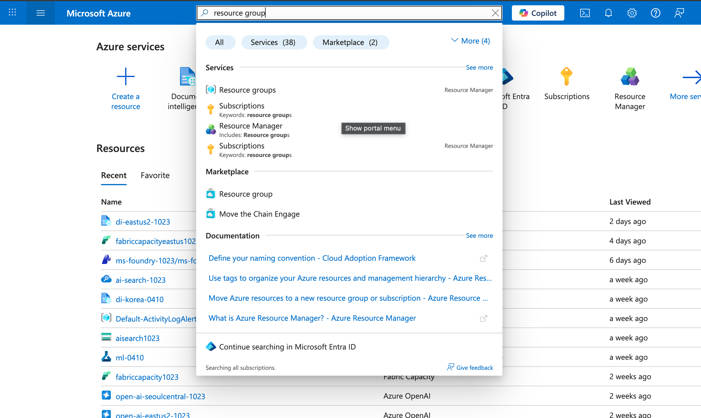
</kbd>

3. **새 리소스 그룹 생성**
   - `+ Create` 버튼 클릭

<kbd>
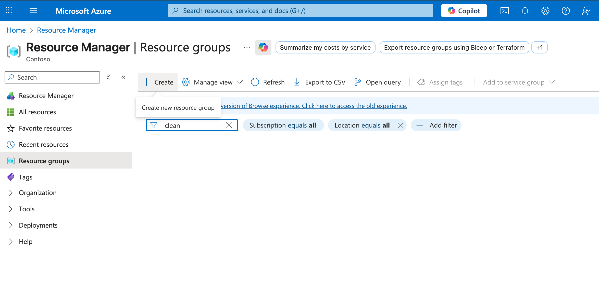
</kbd>

4. **기본 정보 입력**

   | 필드 | 값 | 설명 |
   |------|-----|------|
   | Subscription | 본인 구독 선택 | 사용할 Azure 구독 |
   | Resource group | `rg-doc-intelligence-lab` | 리소스 그룹 이름 |
   | Region | `East US` | 지역 설정 |

<kbd>
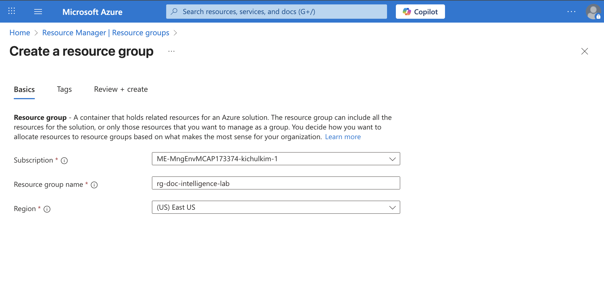
</kbd>

1. **검토 및 생성**
   - `Review + create` 클릭
   - 검증 통과 후 `Create` 클릭

<kbd>
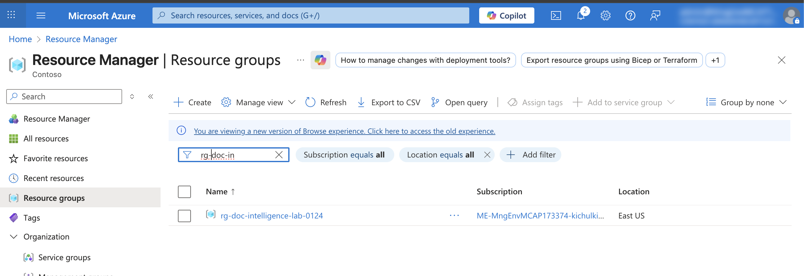
</kbd>

---

## 3. Azure Blob Storage 생성

Blob Storage는 문서 파일을 저장하는 데 사용됩니다.

### 단계별 가이드

1. **Storage Account 메뉴 이동**
   - 상단 검색창에 "Storage accounts" 입력
   - "Storage accounts" 클릭

<kbd>
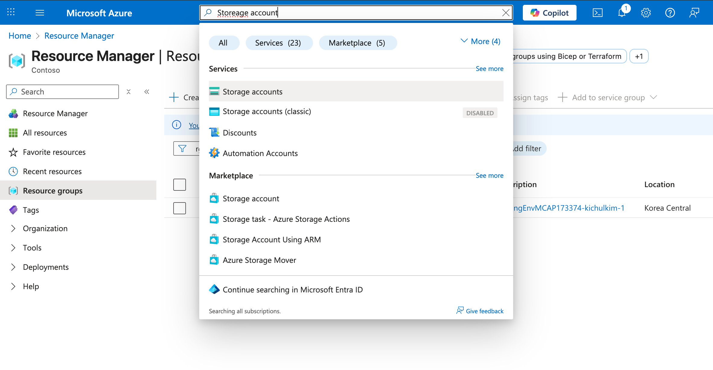
</kbd>

2. **새 Storage Account 생성**
   - `+ Create` 버튼 클릭

3. **기본 정보 입력 (Basics 탭)**

   | 필드 | 값 | 설명 |
   |------|-----|------|
   | Subscription | 본인 구독 선택 | |
   | Resource group | `rg-doc-intelligence-lab` | 앞서 생성한 리소스 그룹 |
   | Storage account name | `stdocintellab[고유번호]` | 전역적으로 고유해야 함 (소문자, 숫자만) |
   | Region | `East US` | 리소스 그룹과 동일 지역 |
   | Primary service | `Azure Blob Storage or Azure Data Lake Storage Gen2` | 문서 저장용 Blob 선택 |
   | Performance | `Standard` | 실습용으로 충분 |
   | Redundancy | `LRS` (Locally-redundant storage) | 비용 절ㅌ약을 위해 선택 |

   > ⚠️ **주의**: Storage account name은 Azure 전체에서 고유해야 합니다. 본인의 이니셜이나 날짜를 추가하세요. (예: `stdocintellab0115`)

<kbd>
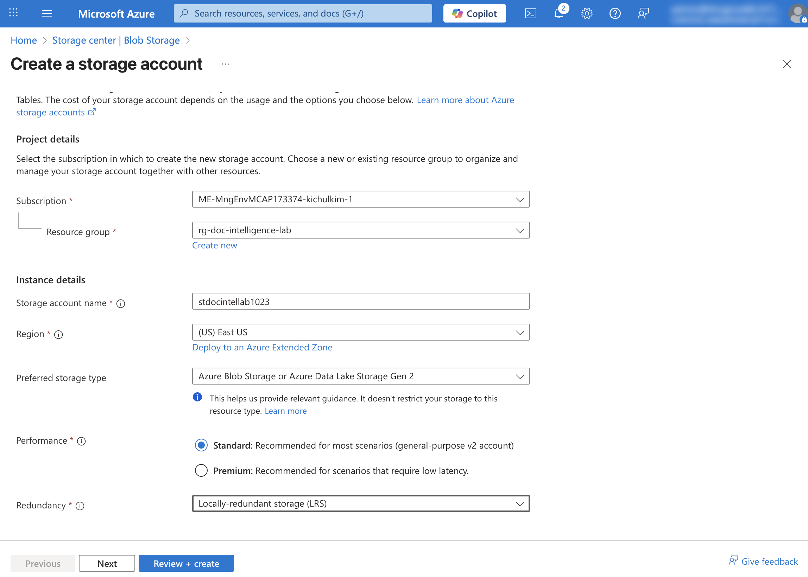
</kbd>

<!-- 4. **고급 설정 (Advanced 탭)** 
   - `Allow enabling anonymous access on individual containers`: **체크** (실습 편의를 위해)
   - 나머지는 기본값 유지

<kbd>
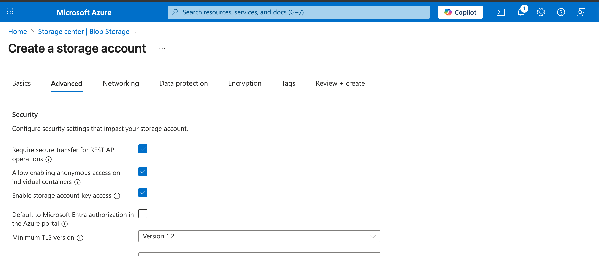
</kbd> -->

1. **검토 및 생성**
   - `Review + create` 클릭
   - 검증 통과 후 `Create` 클릭
   - 배포 완료까지 약 1-2분 소요

<kbd>

</kbd>

<!-- 
### Entra authorization 설정
    - 생성한 Storage Account 의 Settings > Configuration 메뉴로 이동
    - "Default to Microsoft Entra authorization in the Azure portal
" 옵션을 "Enabled" 로 확인
    - 저장 (Save) 클릭

    <kbd>
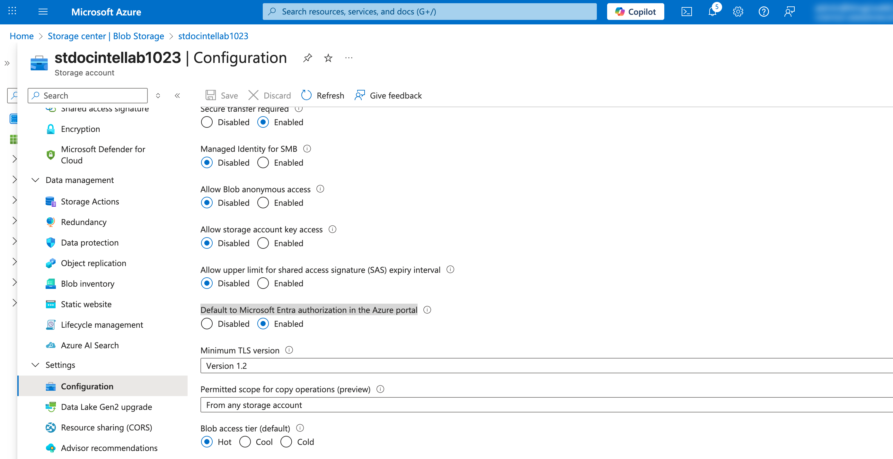
</kbd> -->

### Blob Container 생성

1. **생성된 Storage Account로 이동**
   - "Go to resource" 클릭 또는 Storage accounts 목록에서 선택

2. **Container 생성**
   - 왼쪽 메뉴에서 `Data storage` > `Containers` 클릭
   - `+ Container` 버튼 클릭

<kbd>
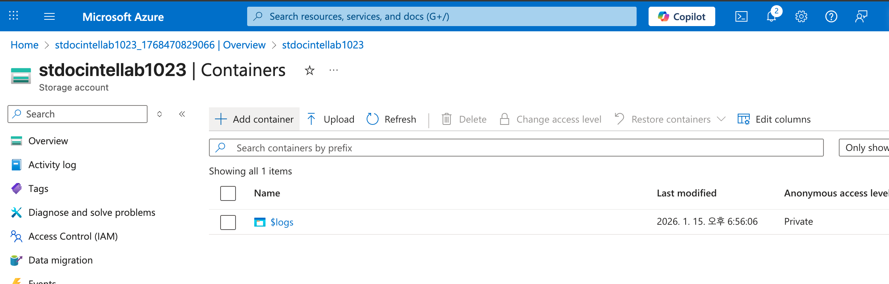
</kbd>

3. **Container 설정**

   | 필드 | 값 | 설명 |
   |------|-----|------|
   | Name | `documents` | 문서를 저장할 컨테이너 |
   | Anonymous access level | `Private (no anonymous access)` | 보안을 위해 Private 설정 |

   > 🔒 **보안 참고**: Private으로 설정하면 익명 접근이 차단됩니다. AI Search에서는 **연결 문자열(Connection String)** 또는 **Managed Identity**를 통해 안전하게 접근합니다.

<kbd>
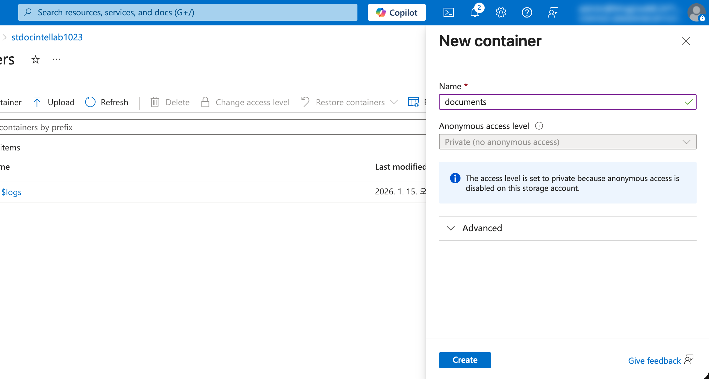
</kbd>

4. **Create 클릭하여 생성 완료**

5. **Container 추가 생성**
    - 동일한 방법으로 `output` 컨테이너 생성합니다.
  
    | 필드 | 값 | 설명 |
   |------|-----|------|
   | Name | `output` | Document Intelligence 출력 저장 컨테이너 |
   | Anonymous access level | `Private (no anonymous access)` | 보안을 위해 Private 설정 |

<kbd>
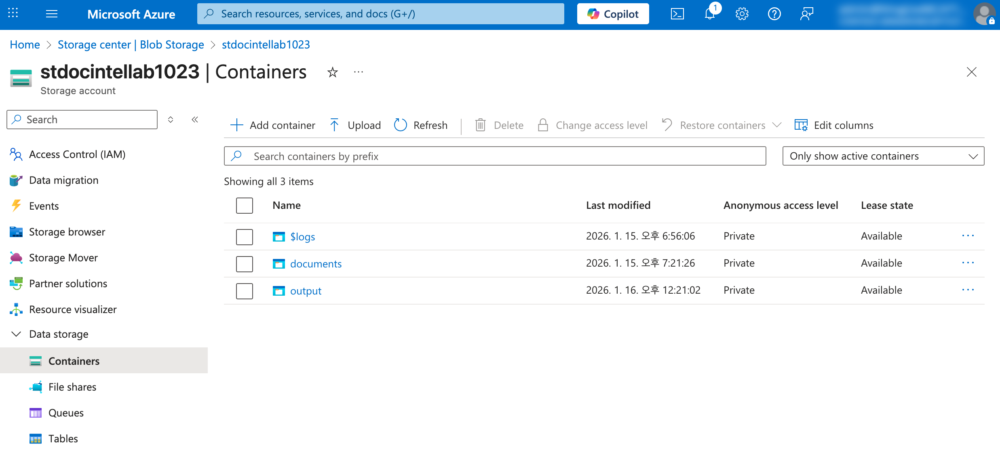
</kbd>

---

## 4. (Skip, 5번 진행) Azure Document Intelligence 생성

Document Intelligence 는 문서에서 텍스트, 테이블, 구조 등을 추출하는 AI 서비스입니다. Document Intelligence 를 독립적으로 사용할 때는 이 방식을 선택합니다. **만약 AI Search 와 직접 연동하여 사용할 경우, Azure AI 서비스 (Multi-services) 를 생성합니다.**

### 단계별 가이드

1. **Document Intelligence 메뉴 이동**
   - 상단 검색창에 "Document Intelligence" 입력
   - "Document Intelligence" 클릭

<kbd>
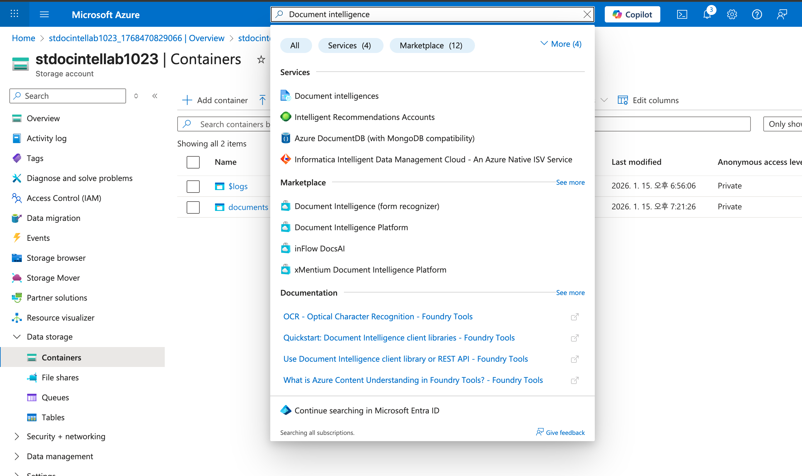
</kbd>

2. **새 Document Intelligence 생성**
   - `+ Create` 버튼 클릭

3. **기본 정보 입력**

   | 필드 | 값 | 설명 |
   |------|-----|------|
   | Subscription | 본인 구독 선택 | |
   | Resource group | `rg-doc-intelligence-lab` | |
   | Region | `East US` | 기능 가용성 확인 필요 |
   | Name | `doc-intel-lab-[고유번호]` | 전역적으로 고유해야 함 |
   | Pricing tier | `Standard S0` | Standard 권장 |

<kbd>
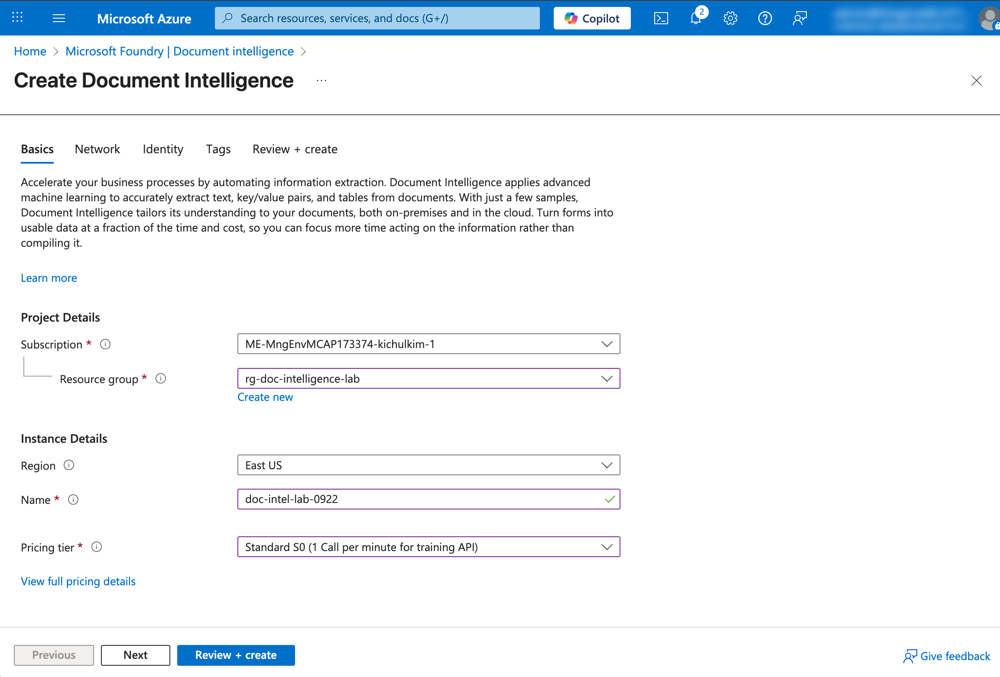
</kbd>

4. **네트워크 설정 (Networking 탭)**
   - `All networks, including the internet, can access this resource` 선택

<kbd>
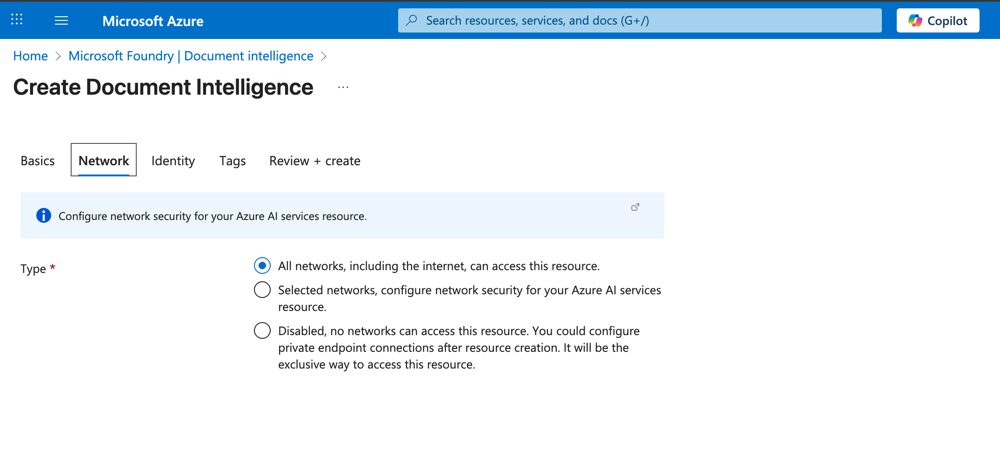
</kbd>

5. **검토 및 생성**
   - `Review + create` 클릭
   - 검증 통과 후 `Create` 클릭
   - 배포 완료까지 약 1-2분 소요

<kbd>
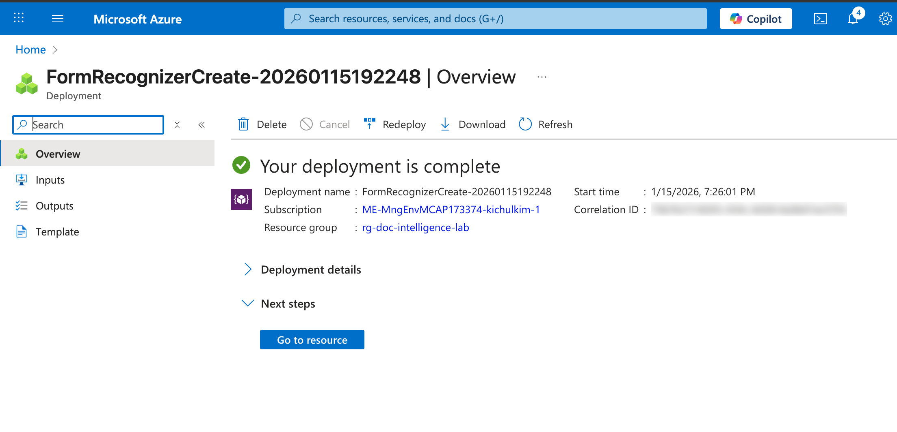
</kbd>

---

## 5. Azure AI Search 생성

AI Search는 전문 검색 서비스로, Document Intelligence와 연동하여 문서 검색을 제공합니다.

### 단계별 가이드

1. **AI Search 메뉴 이동**
   - 상단 검색창에 "AI Search" 또는 "Search services" 입력
   - "AI Search" 클릭

<kbd>
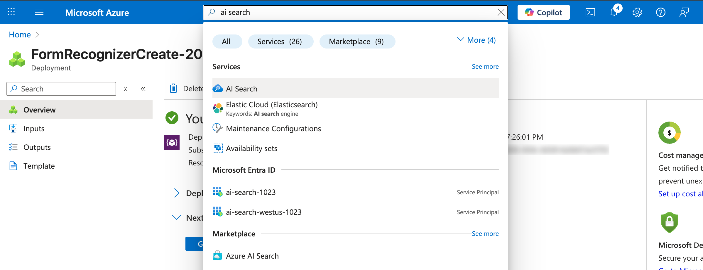
</kbd>

2. **새 Search Service 생성**
   - `+ Create` 버튼 클릭

3. **기본 정보 입력**

   | 필드 | 값 | 설명 |
   |------|-----|------|
   | Subscription | 본인 구독 선택 | |
   | Resource group | `rg-doc-intelligence-lab` | |
   | Service name | `search-doc-lab-[고유번호]` | 전역적으로 고유해야 함 |
   | Location | `East US` | 혹은 `North Central US` |
   | Pricing tier | `Free` | 혹은 `Basic` |

   | Tier | 특징 |
   |------|------|
   | Free | 50MB 스토리지, 10,000 문서, 인덱스 3개 |
   | Basic | 2GB 스토리지, 1백만 문서, 인덱스 15개 |

   > ⚠️ **주의**: Document Intelligence와 연동 기능은 현재 East US, West Europe, North Central US 리전에서만 지원합니다.

   > ⚠️ **주의**: Free tier는 구독당 1개만 생성 가능합니다. 이미 있다면 `Basic` tier를 선택하세요.

<kbd>
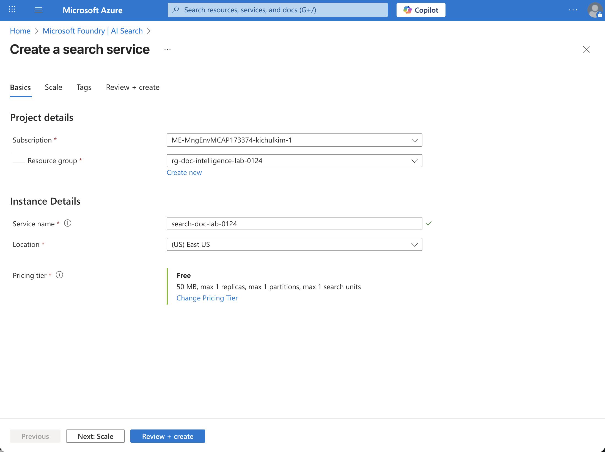
</kbd>

<!-- 1. **가격 책정 계층 선택**
   - `Change Pricing Tier` 클릭하여 `Free` 선택
   
   | Tier | 특징 |
   |------|------|
   | Free | 50MB 스토리지, 10,000 문서, 인덱스 3개 |
   | Basic | 2GB 스토리지, 1백만 문서, 인덱스 15개 |

<kbd>
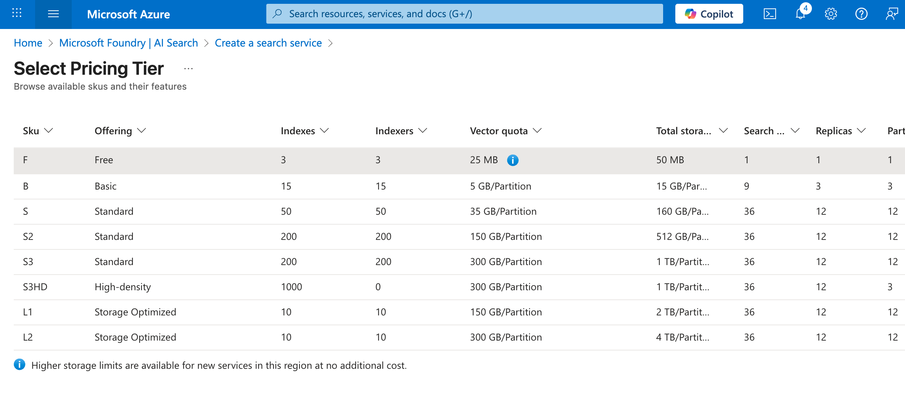
</kbd> -->

1. **검토 및 생성**
   - `Review + create` 클릭
   - 검증 통과 후 `Create` 클릭
   - 배포 완료까지 약 2-5분 소요

<kbd>
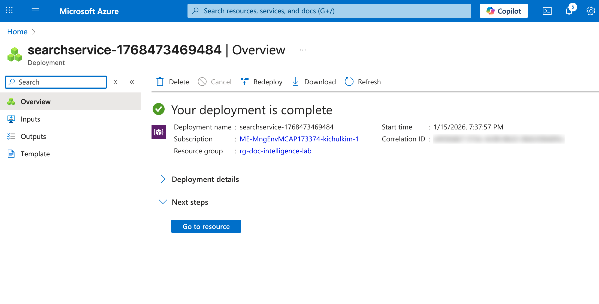
</kbd>

---

## 6. Azure Document Intelligence 생성 - Azure AI Services (Multi-services)

Document Intelligence를 AI Search와 직접 연동하여 사용할 때는 Azure AI Services (Multi-services)를 생성합니다. Multi-services 리소스는 Document Intelligence를 포함한 여러 Azure AI 서비스를 하나의 엔드포인트와 키로 통합 관리할 수 있습니다.

### 단계별 가이드

1. **Azure AI Services 메뉴 이동**
   - 상단 검색창에 "Azure AI services" 입력
   - "Azure AI services" 클릭

<kbd>
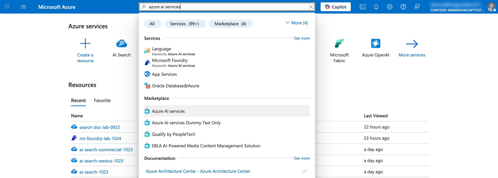
</kbd>

2. **새 Azure AI Services 생성**
   - `+ Create` 버튼 클릭
   - "Azure AI services multi-service account" 선택

3. **기본 정보 입력 (Basics 탭)**

   | 필드 | 값 | 설명 |
   |------|-----|------|
   | Subscription | 본인 구독 선택 | |
   | Resource group | `rg-doc-intelligence-lab` | 앞서 생성한 리소스 그룹 |
   | Region | `East US` | 혹은 `North Central US` AI Search 와 동일 지역으로 합니다 |
   | Name | `ai-services-lab-[고유번호]` | 전역적으로 고유해야 함 |
   | Pricing tier | `Standard S0` | 표준 요금제 |

   > 💡 **팁**: Multi-services 리소스는 Document Intelligence, Computer Vision, Language 등 여러 서비스를 하나의 키로 사용할 수 있어 관리가 편리합니다.

<kbd>
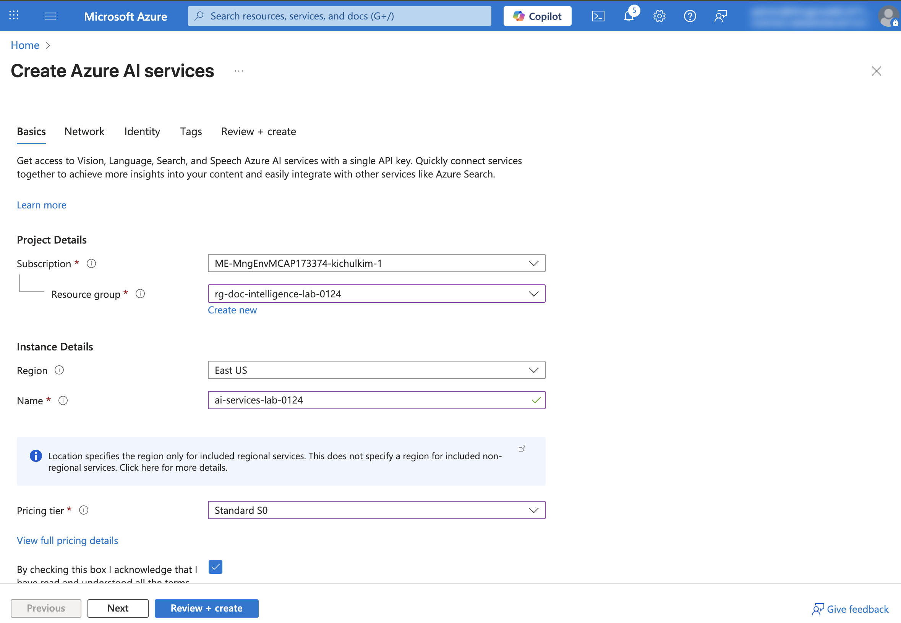
</kbd>

<!-- 1. **네트워크 설정 (Networking 탭)**
   - `All networks, including the internet, can access this resource` 선택
   - 실습 환경에서는 모든 네트워크 접근 허용

<kbd>
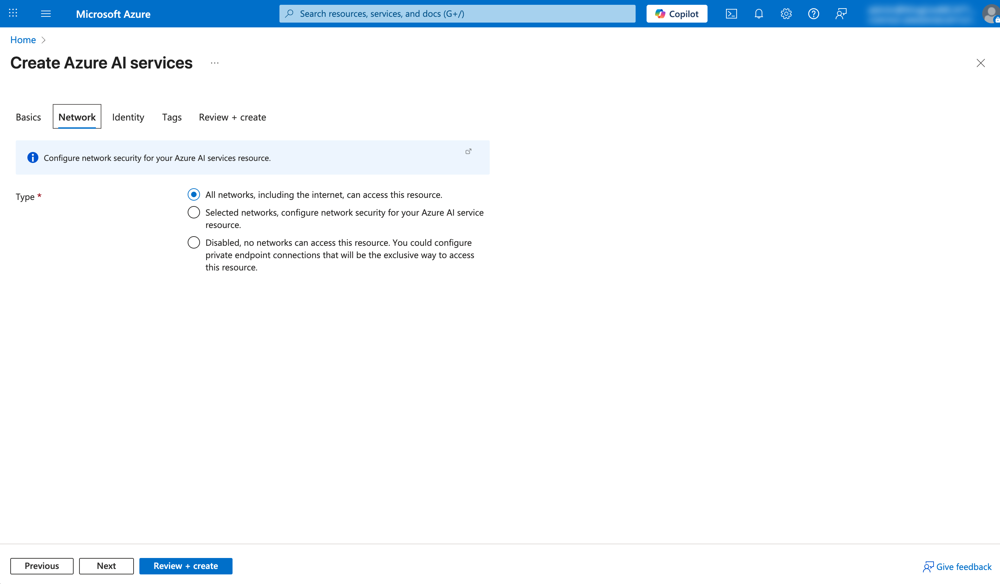
</kbd>

1. **ID 설정 (Identity 탭)**
   - System assigned managed identity: `On` 선택
   - Managed Identity를 활성화하면 다른 Azure 리소스와 안전하게 연동 가능

<kbd>

</kbd> -->

4. **검토 및 생성**
   - `Review + create` 클릭
   - 검증 통과 후 `Create` 클릭
   - 배포 완료까지 약 1-2분 소요

<kbd>
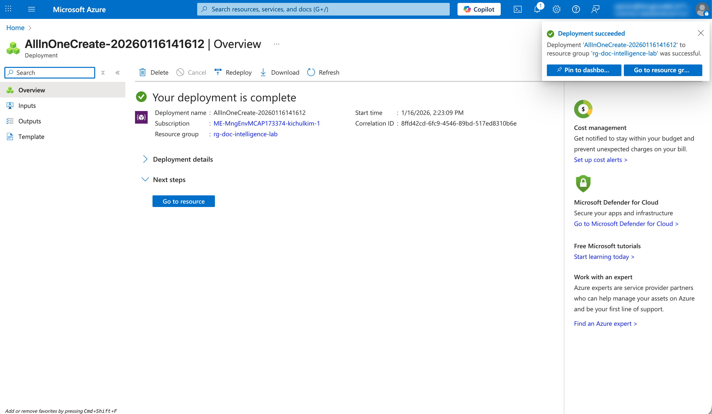
</kbd>

### Document Intelligence vs Multi-services 비교

| 항목 | Document Intelligence (단독) | Azure AI Services (Multi-services) |
|------|------------------------------|-----------------------------------|
| 용도 | Document Intelligence만 사용 | 여러 AI 서비스 통합 사용 |
| AI Search 연동 | 별도 설정 필요 | 직접 연동 지원 |
| 관리 | 개별 키/엔드포인트 관리 | 통합 키/엔드포인트 관리 |

---

## 7. Microsoft Foundry 생성

Microsoft Foundry는 AI 모델을 배포하고 관리하는 통합 플랫폼입니다. 문서 처리 결과를 AI 모델로 분석하거나, 검색 결과를 증강하는 데 사용합니다.

### 단계별 가이드

#### 7.1 Microsoft Foundry 생성

1. **Microsoft Foundry 메뉴 이동**
   - 상단 검색창에 "Microsoft Foundry" 입력
   - "Microsoft Foundry" 클릭

    <kbd>
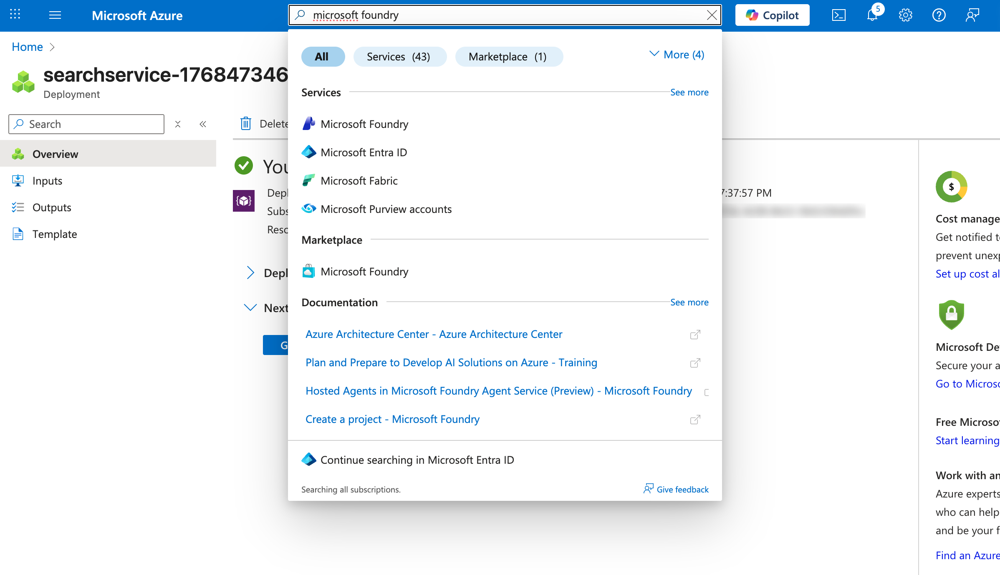
</kbd>

2. **새 Foundry 생성**
   - `Create a Foundry Resource` 버튼 클릭

    <kbd>
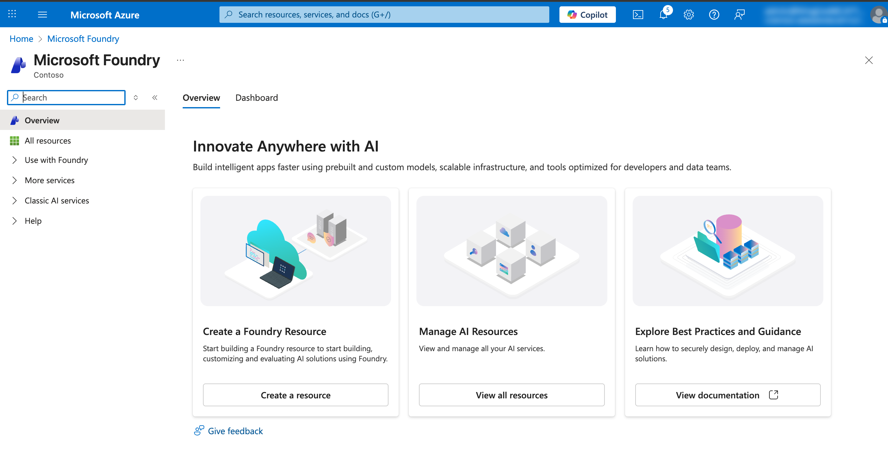
</kbd>

3. **기본 정보 입력 (Basics 탭)**

   | 필드 | 값 | 설명 |
   |------|-----|------|
   | Subscription | 본인 구독 선택 | |
   | Resource group | `rg-doc-intelligence-lab` | 동일한 리소스 그룹 사용 |
   | Name | `ms-foundry-lab-[고유번호]` | Foundry 이름 |
   | Region | `East US` | 모델 가용성 확인 필요 |

   > 💡 **팁**: Region은 사용하려는 AI 모델(GPT-4o, text-embedding-3 등)이 지원되는 지역을 선택하세요.

<kbd>
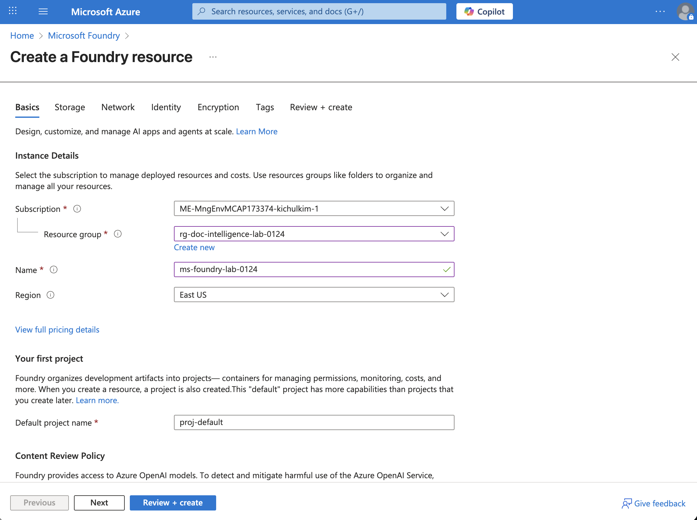
</kbd>

4. **검토 및 생성**
   - `Review + create` 클릭
   - 검증 통과 후 `Create` 클릭
   - 배포 완료까지 약 3-5분 소요

<kbd>
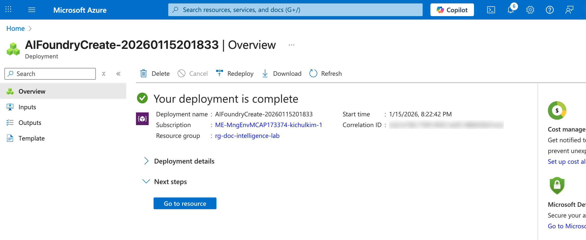
</kbd>

#### 7.2 Microsoft Foundry Portal 접속

1. **생성된 리소스로 이동**
   - 배포 완료 후 `Go to resource` 버튼 클릭

2. **Foundry Portal 이동**
   - Overview 페이지에서 `Go to Foundry portal` 버튼 클릭

<kbd>
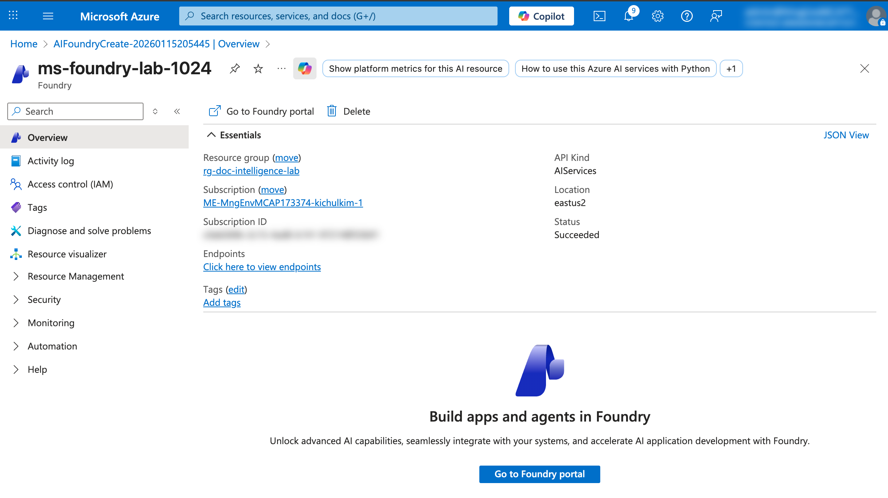
</kbd>

#### 7.3 AI 모델 배포

문서 처리 및 검색 증강에 필요한 AI 모델을 배포합니다.

1. **Discover + Models 이동**
   - 왼쪽 메뉴에서 `Models + endpoints` 클릭

2. **새 모델 배포**
   - `+ Deploy model` 버튼 클릭
   - `Deploy base model` 선택

<kbd>
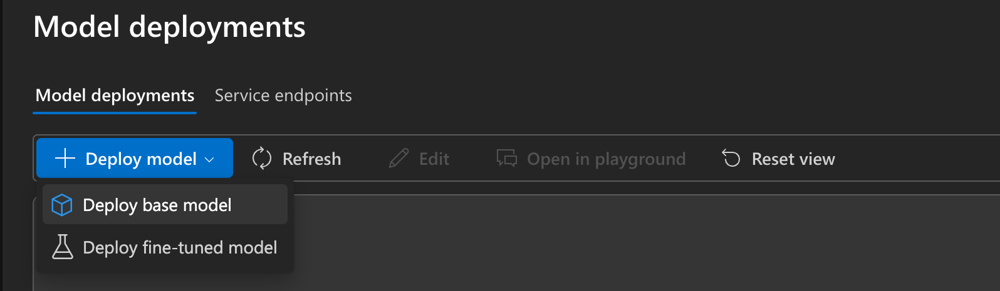
</kbd>

3. **GPT-4o 모델 배포** (텍스트 생성용)
   
   | 필드 | 값 | 설명 |
   |------|-----|------|
   | Model | `gpt-4o` | 텍스트 생성 및 분석용 |
   | Deployment name | `gpt-4o` | 배포 이름 (기본값 사용) |
   | Deployment type | `Global Standard` | 비용 효율적인 옵션 |

   - `Deploy` 클릭

<kbd>
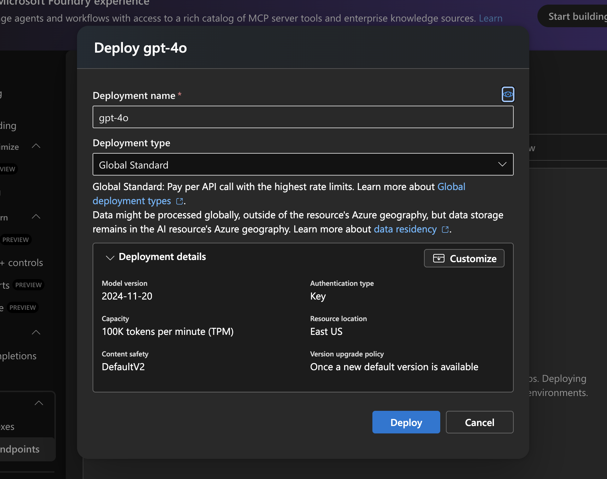
</kbd>

4. **text-embedding-3-large 모델 배포** (벡터 생성용)
   
   - 다시 `+ Deploy model` > `Deploy base model` 클릭
   
   | 필드 | 값 | 설명 |
   |------|-----|------|
   | Model | `text-embedding-3-large` | 벡터 임베딩 생성용 |
   | Deployment name | `text-embedding-3-large` | 배포 이름 (기본값 사용) |
   | Deployment type | `Global Standard` | 비용 효율적인 옵션 |

   - `Deploy` 클릭

<kbd>
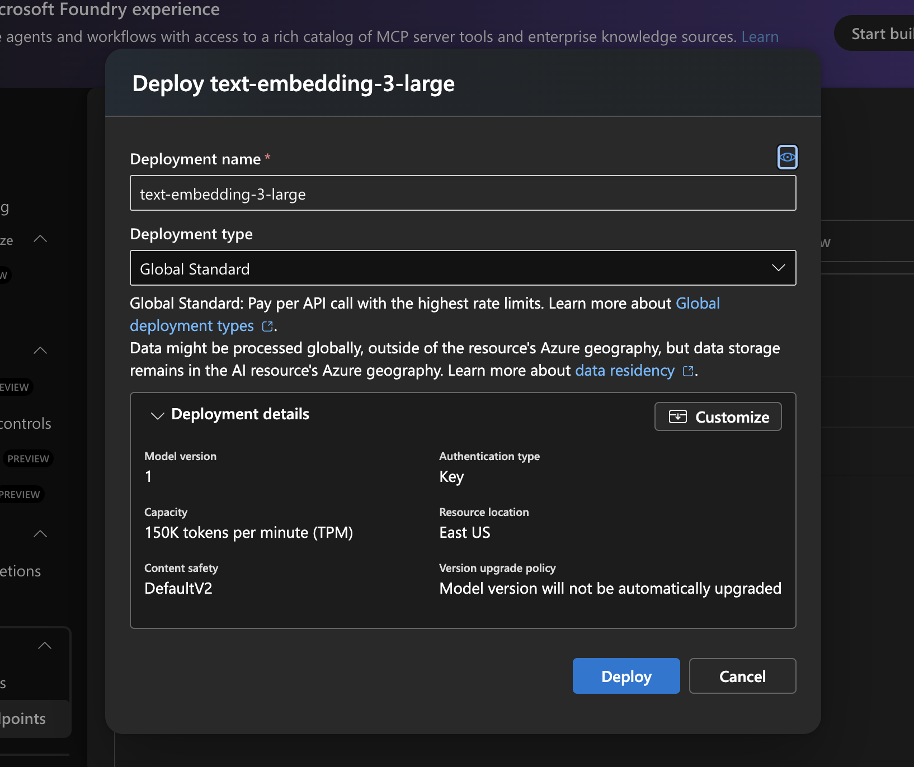
</kbd>

5. **배포 완료 확인**
   - `Models + endpoints` 목록에서 두 모델이 `Succeeded` 상태인지 확인

   | 모델 | 용도 |
   |------|------|
   | `gpt-4o` | 문서 요약, Q&A, 텍스트 생성 |
   | `text-embedding-3-large` | 의미 기반 벡터 검색 |

<kbd>
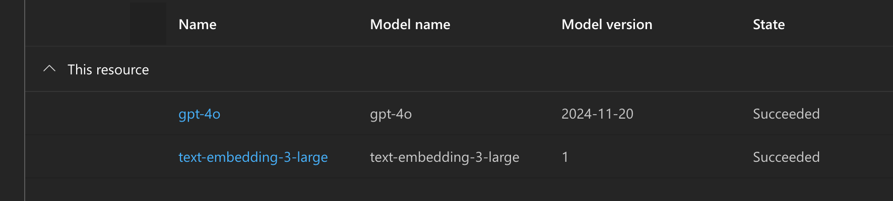
</kbd>

> 📝 **참고**: 모델 배포 후 API 호출에 사용할 엔드포인트와 키는 각 모델의 상세 페이지에서 확인할 수 있습니다.

---

## 📝 생성된 리소스 요약

| 리소스 | 이름 예시 | 용도 |
|--------|----------|------|
| Resource Group | `rg-doc-intelligence-lab` | 리소스 그룹화 |
| Storage Account | `stdocintellab0115` | 문서 저장 |
| Blob Container | `documents` | 문서 파일 컨테이너 |
| Document Intelligence | `doc-intel-lab-0115` | 문서 분석 |
| Document Intelligence - Multi-services | `ai-services-lab-0115` | 통합 AI 서비스 |
| AI Search | `search-doc-lab-0115` | 검색 인덱싱 |
| Microsoft Foundry | `ms-foundry-lab-0115` | AI 모델 관리 |
| Foundry Project | `doc-search-project` | AI 워크스페이스 |

---

## ✅ 체크리스트

셋업이 완료되었는지 확인하세요:

- [ ] Resource Group 생성 완료
- [ ] Storage Account 생성 완료
- [ ] Blob Container (`documents`) 생성 완료
- [ ] Document Intelligence 생성 완료
- [ ] AI Search 생성 완료
- [ ] Microsoft Foundry Hub 및 Project 생성 완료
- [ ] GPT-4o 모델 배포 완료
- [ ] text-embedding-3-large 모델 배포 완료

---

## 🔜 다음 단계

환경 셋업이 완료되면 다음 튜토리얼에서 Microsoft Entra ID 기반의 보안 연동 설정을 진행합니다.

➡️ [02. Microsoft Entra ID 기반 리소스 연동 설정](./02-entra-id-setup.md)

---

## 🆘 문제 해결

### Q: Storage account name이 이미 사용 중이라고 나옵니다.
**A:** Storage account name은 전역적으로 고유해야 합니다. 이름에 본인 이니셜, 날짜, 임의의 숫자를 추가하세요.

### Q: Free tier AI Search를 생성할 수 없습니다.
**A:** 구독당 Free tier는 1개로 제한됩니다. 기존 Free tier Search 서비스를 삭제하거나 Basic tier를 사용하세요.

### Q: 리소스 생성 시 권한 오류가 발생합니다.
**A:** 구독에 대한 Contributor 이상의 권한이 필요합니다. 관리자에게 문의하세요.
