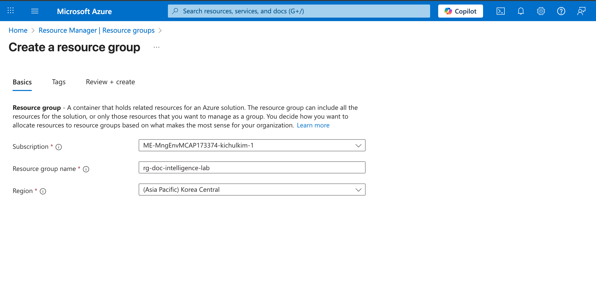
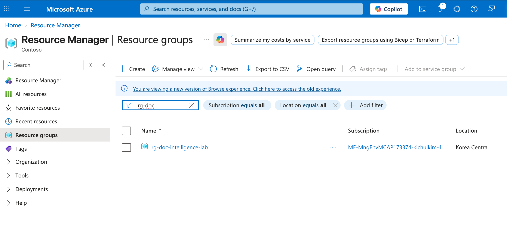
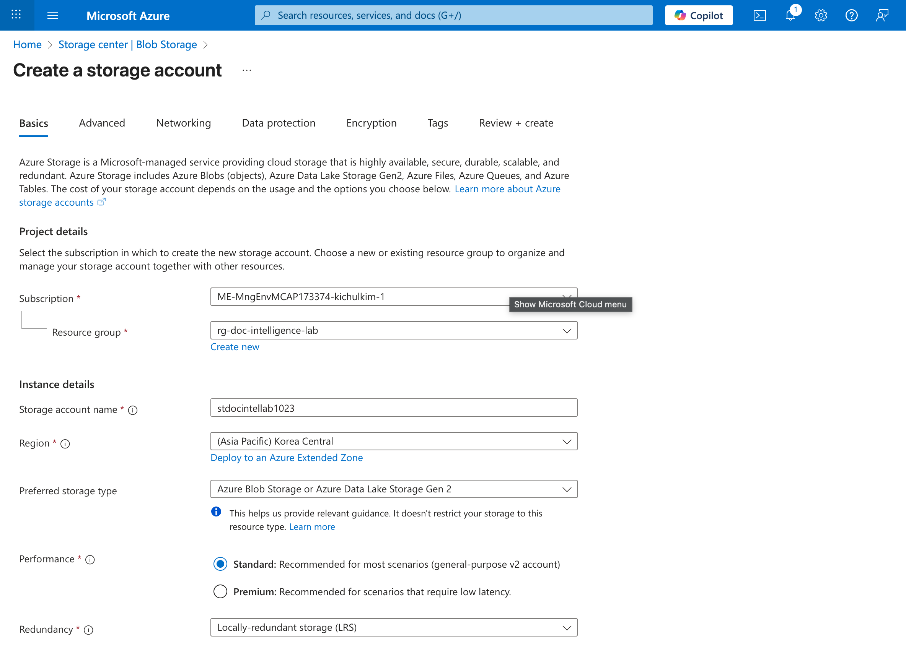
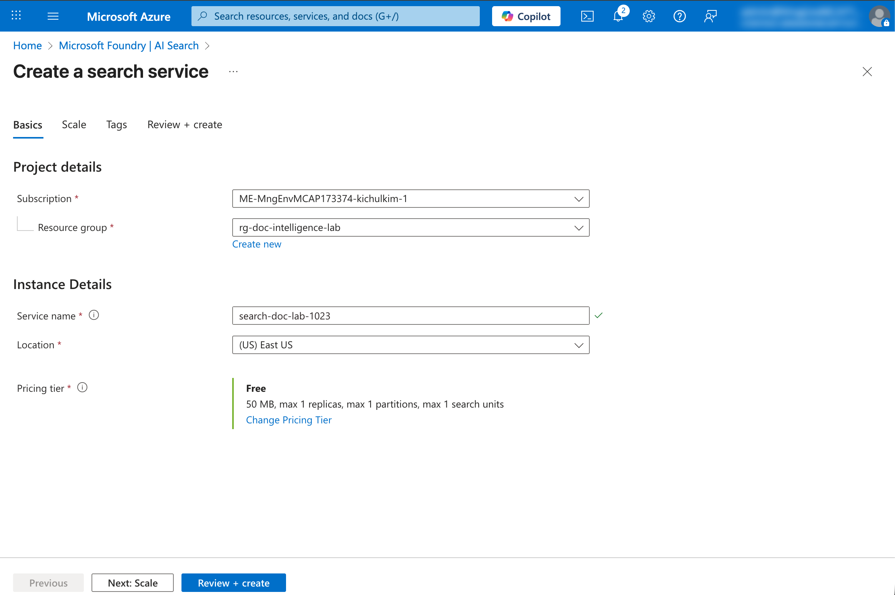

# 01. Azure 환경 셋업 가이드

이 문서에서는 Azure Document Intelligence와 AI Search를 활용한 문서 처리 및 검색 시스템 구축을 위한 환경 셋업 방법을 안내합니다.

## 📋 목차

1. [사전 요구사항](#1-사전-요구사항)
2. [Azure 리소스 그룹 생성](#2-azure-리소스-그룹-생성)
3. [Azure Blob Storage 생성](#3-azure-blob-storage-생성)
4. [Azure Document Intelligence 생성](#4-azure-document-intelligence-생성)
5. [Azure AI Search 생성](#5-azure-ai-search-생성)
6. [리소스 연결 정보 확인](#6-리소스-연결-정보-확인)

---

## 1. 사전 요구사항

### 필수 준비 사항

| 항목 | 설명 |
|------|------|
| Azure 구독 | 유효한 Azure 구독이 필요합니다 |
| Azure Portal 접근 | [https://portal.azure.com](https://portal.azure.com) 접속 가능해야 합니다 |
| 권한 | 리소스 생성 권한이 있는 계정 (Contributor 이상) |

### 실습에서 생성할 리소스

| 리소스 | 용도 |
|--------|------|
| **Resource Group** | 모든 리소스를 그룹화하여 관리 |
| **Storage Account** | 문서 파일 저장 (Blob Storage) |
| **Document Intelligence** | 문서에서 텍스트 및 구조 추출 |
| **AI Search** | 추출된 데이터 인덱싱 및 검색 |

---

## 2. Azure 리소스 그룹 생성re

리소스 그룹은 Azure 리소스들을 논리적으로 그룹화하는 컨테이너입니다.

### 단계별 가이드

1. **Azure Portal 로그인**
   - [https://portal.azure.com](https://portal.azure.com) 접속
   - Azure 계정으로 로그인

2. **리소스 그룹 메뉴 이동**
   - 상단 검색창에 "Resource groups" 입력
   - 또는 왼쪽 메뉴에서 "Resource groups" 클릭

   

3. **새 리소스 그룹 생성**
   - `+ Create` 버튼 클릭

   

4. **기본 정보 입력**

   | 필드 | 값 | 설명 |
   |------|-----|------|
   | Subscription | 본인 구독 선택 | 사용할 Azure 구독 |
   | Resource group | `rg-doc-intelligence-lab` | 리소스 그룹 이름 |
   | Region | `Korea Central` | 가장 가까운 지역 선택 |

   

5. **검토 및 생성**
   - `Review + create` 클릭
   - 검증 통과 후 `Create` 클릭

   

---

## 3. Azure Blob Storage 생성

Blob Storage는 문서 파일을 저장하는 데 사용됩니다.

### 단계별 가이드

1. **Storage Account 메뉴 이동**
   - 상단 검색창에 "Storage accounts" 입력
   - "Storage accounts" 클릭

   

2. **새 Storage Account 생성**
   - `+ Create` 버튼 클릭

3. **기본 정보 입력 (Basics 탭)**

   | 필드 | 값 | 설명 |
   |------|-----|------|
   | Subscription | 본인 구독 선택 | |
   | Resource group | `rg-doc-intelligence-lab` | 앞서 생성한 리소스 그룹 |
   | Storage account name | `stdocintellab[고유번호]` | 전역적으로 고유해야 함 (소문자, 숫자만) |
   | Region | `Korea Central` | 리소스 그룹과 동일 지역 |
   | Primary service | `Azure Blob Storage or Azure Data Lake Storage Gen2` | 문서 저장용 Blob 선택 |
   | Performance | `Standard` | 실습용으로 충분 |
   | Redundancy | `LRS` (Locally-redundant storage) | 비용 절약을 위해 선택 |

   > ⚠️ **주의**: Storage account name은 Azure 전체에서 고유해야 합니다. 본인의 이니셜이나 날짜를 추가하세요. (예: `stdocintellab0115`)

   

<!-- 4. **고급 설정 (Advanced 탭)** 
   - `Allow enabling anonymous access on individual containers`: **체크** (실습 편의를 위해)
   - 나머지는 기본값 유지

    -->

5. **검토 및 생성**
   - `Review + create` 클릭
   - 검증 통과 후 `Create` 클릭
   - 배포 완료까지 약 1-2분 소요

   

### Blob Container 생성

1. **생성된 Storage Account로 이동**
   - "Go to resource" 클릭 또는 Storage accounts 목록에서 선택

2. **Container 생성**
   - 왼쪽 메뉴에서 `Data storage` > `Containers` 클릭
   - `+ Container` 버튼 클릭

   

3. **Container 설정**

   | 필드 | 값 | 설명 |
   |------|-----|------|
   | Name | `documents` | 문서를 저장할 컨테이너 |
   | Anonymous access level | `Private (no anonymous access)` | 보안을 위해 Private 설정 |

   > 🔒 **보안 참고**: Private으로 설정하면 익명 접근이 차단됩니다. AI Search에서는 **연결 문자열(Connection String)** 또는 **Managed Identity**를 통해 안전하게 접근합니다.

   

4. **Create 클릭하여 생성 완료**

---

## 4. Azure Document Intelligence 생성

Document Intelligence(구 Form Recognizer)는 문서에서 텍스트, 테이블, 구조 등을 추출하는 AI 서비스입니다.

### 단계별 가이드

1. **Document Intelligence 메뉴 이동**
   - 상단 검색창에 "Document Intelligence" 입력
   - "Document Intelligence" 클릭

   

2. **새 Document Intelligence 생성**
   - `+ Create` 버튼 클릭

3. **기본 정보 입력**

   | 필드 | 값 | 설명 |
   |------|-----|------|
   | Subscription | 본인 구독 선택 | |
   | Resource group | `rg-doc-intelligence-lab` | |
   | Region | `Korea Central` | 또는 `East US` (기능 가용성 확인) |
   | Name | `doc-intel-lab-[고유번호]` | 전역적으로 고유해야 함 |
   | Pricing tier | `Free F0` 또는 `Standard S0` | 실습용은 Free 권장 |

   > 💡 **팁**: Free tier는 월 500페이지까지 무료입니다. 실습에 충분합니다.

   

4. **네트워크 설정 (Networking 탭)**
   - `All networks, including the internet, can access this resource` 선택

   

5. **검토 및 생성**
   - `Review + create` 클릭
   - 검증 통과 후 `Create` 클릭
   - 배포 완료까지 약 1-2분 소요

   

---

## 5. Azure AI Search 생성

AI Search(구 Cognitive Search)는 전문 검색 서비스로, Document Intelligence와 연동하여 문서 검색을 제공합니다.

### 단계별 가이드

1. **AI Search 메뉴 이동**
   - 상단 검색창에 "AI Search" 또는 "Search services" 입력
   - "AI Search" 클릭

   

2. **새 Search Service 생성**
   - `+ Create` 버튼 클릭

3. **기본 정보 입력**

   | 필드 | 값 | 설명 |
   |------|-----|------|
   | Subscription | 본인 구독 선택 | |
   | Resource group | `rg-doc-intelligence-lab` | |
   | Service name | `search-doc-lab-[고유번호]` | 전역적으로 고유해야 함 |
   | Location | `Korea Central` | |
   | Pricing tier | `Free` | 실습용으로 충분 |

   > ⚠️ **주의**: Free tier는 구독당 1개만 생성 가능합니다. 이미 있다면 `Basic` tier를 선택하세요.

   

4. **가격 책정 계층 선택**
   - `Change Pricing Tier` 클릭하여 `Free` 선택
   
   | Tier | 특징 |
   |------|------|
   | Free | 50MB 스토리지, 10,000 문서, 인덱스 3개 |
   | Basic | 2GB 스토리지, 1백만 문서, 인덱스 15개 |

   

5. **검토 및 생성**
   - `Review + create` 클릭
   - 검증 통과 후 `Create` 클릭
   - 배포 완료까지 약 2-5분 소요

   

---

## 6. Microsoft Entra ID 기반 리소스 연동 설정

Key 기반 인증 대신 **Microsoft Entra ID (구 Azure AD)** 기반의 역할 기반 접근 제어(RBAC)를 사용하여 보안을 강화합니다.

> 🔐 **보안 권장사항**: Entra ID 기반 인증은 키 유출 위험이 없고, 세밀한 권한 제어가 가능하며, 감사 로그를 통한 추적이 용이합니다.

### 6.1 AI Search Managed Identity 활성화

AI Search가 다른 Azure 리소스에 안전하게 접근할 수 있도록 System Managed Identity를 활성화합니다.

1. **AI Search 리소스로 이동**
2. **왼쪽 메뉴 > Settings > Identity** 클릭
3. **System assigned 탭에서 Status를 `On`으로 변경**
4. **Save 클릭**

   

5. **Object ID 메모** (역할 할당 시 사용)

   > 💡 **참고**: Save 후 Object ID가 생성됩니다. 이 ID가 AI Search의 고유 식별자입니다.

### 6.2 Storage Account에 역할 할당

AI Search가 Blob Storage의 문서를 읽을 수 있도록 역할을 할당합니다.

1. **Storage Account로 이동**
2. **왼쪽 메뉴 > Access Control (IAM)** 클릭
3. **`+ Add` > `Add role assignment`** 클릭

   

4. **Role 탭에서 역할 선택**
   - 검색창에 "Storage Blob Data Reader" 입력
   - `Storage Blob Data Reader` 선택
   - `Next` 클릭

   | 역할 | 권한 |
   |------|------|
   | Storage Blob Data Reader | Blob 데이터 읽기 전용 |
   | Storage Blob Data Contributor | Blob 데이터 읽기/쓰기 |

   

5. **Members 탭에서 멤버 추가**
   - `Assign access to`: **Managed identity** 선택
   - `+ Select members` 클릭
   - `Managed identity` 드롭다운에서 **Search service** 선택
   - 앞서 생성한 AI Search 서비스 선택
   - `Select` 클릭

   

6. **Review + assign 클릭하여 역할 할당 완료**

   

### 6.3 Document Intelligence에 역할 할당

AI Search가 Document Intelligence를 사용할 수 있도록 역할을 할당합니다.

1. **Document Intelligence 리소스로 이동**
2. **왼쪽 메뉴 > Access Control (IAM)** 클릭
3. **`+ Add` > `Add role assignment`** 클릭

4. **Role 탭에서 역할 선택**
   - 검색창에 "Cognitive Services User" 입력
   - `Cognitive Services User` 선택
   - `Next` 클릭

   | 역할 | 권한 |
   |------|------|
   | Cognitive Services User | API 호출 권한 |
   | Cognitive Services Contributor | 리소스 관리 + API 호출 |

   

5. **Members 탭에서 멤버 추가**
   - `Assign access to`: **Managed identity** 선택
   - `+ Select members` 클릭
   - `Managed identity` 드롭다운에서 **Search service** 선택
   - 앞서 생성한 AI Search 서비스 선택
   - `Select` 클릭

   

6. **Review + assign 클릭하여 역할 할당 완료**

### 6.4 엔드포인트 정보 확인

Entra ID 인증에서는 키 대신 엔드포인트 URL만 필요합니다.

#### Storage Account
1. **Storage Account > Overview**에서 확인
2. **다음 정보 메모**

   | 항목 | 예시 |
   |------|------|
   | Blob service endpoint | `https://stdocintellab0115.blob.core.windows.net/` |

#### Document Intelligence
1. **Document Intelligence > Overview**에서 확인
2. **다음 정보 메모**

   | 항목 | 예시 |
   |------|------|
   | Endpoint | `https://doc-intel-lab-0115.cognitiveservices.azure.com/` |

#### AI Search
1. **AI Search > Overview**에서 확인
2. **다음 정보 메모**

   | 항목 | 예시 |
   |------|------|
   | URL | `https://search-doc-lab-0115.search.windows.net` |

   

### 6.5 역할 할당 확인

각 리소스에서 역할이 올바르게 할당되었는지 확인합니다.

1. **각 리소스의 Access Control (IAM) > Role assignments 탭** 클릭
2. **AI Search의 Managed Identity가 목록에 있는지 확인**

   | 리소스 | 할당된 역할 | 대상 |
   |--------|------------|------|
   | Storage Account | Storage Blob Data Reader | AI Search |
   | Document Intelligence | Cognitive Services User | AI Search |

   > ⏱️ **참고**: 역할 할당이 적용되기까지 최대 5분 정도 소요될 수 있습니다.

---

## 📝 생성된 리소스 요약

| 리소스 | 이름 예시 | 용도 |
|--------|----------|------|
| Resource Group | `rg-doc-intelligence-lab` | 리소스 그룹화 |
| Storage Account | `stdocintellab0115` | 문서 저장 |
| Blob Container | `documents` | 문서 파일 컨테이너 |
| Document Intelligence | `doc-intel-lab-0115` | 문서 분석 |
| AI Search | `search-doc-lab-0115` | 검색 인덱싱 |

---

## ✅ 체크리스트

셋업이 완료되었는지 확인하세요:

- [ ] Resource Group 생성 완료
- [ ] Storage Account 생성 완료
- [ ] Blob Container (`documents`) 생성 완료
- [ ] Document Intelligence 생성 완료
- [ ] AI Search 생성 완료
- [ ] 각 서비스의 키/엔드포인트 확인 완료

---

## 🔜 다음 단계

환경 셋업이 완료되면 다음 튜토리얼에서 실제 문서를 업로드하고 처리하는 방법을 학습합니다.

➡️ [02. 문서 업로드 및 Document Intelligence 연동](./02-document-upload.md)

---

## 🆘 문제 해결

### Q: Storage account name이 이미 사용 중이라고 나옵니다.
**A:** Storage account name은 전역적으로 고유해야 합니다. 이름에 본인 이니셜, 날짜, 임의의 숫자를 추가하세요.

### Q: Free tier AI Search를 생성할 수 없습니다.
**A:** 구독당 Free tier는 1개로 제한됩니다. 기존 Free tier Search 서비스를 삭제하거나 Basic tier를 사용하세요.

### Q: Document Intelligence에서 Korea Central 지역을 선택할 수 없습니다.
**A:** 일부 기능은 특정 지역에서만 사용 가능합니다. `East US` 또는 `West US 2` 지역을 선택하세요.

### Q: 리소스 생성 시 권한 오류가 발생합니다.
**A:** 구독에 대한 Contributor 이상의 권한이 필요합니다. 관리자에게 문의하세요.
