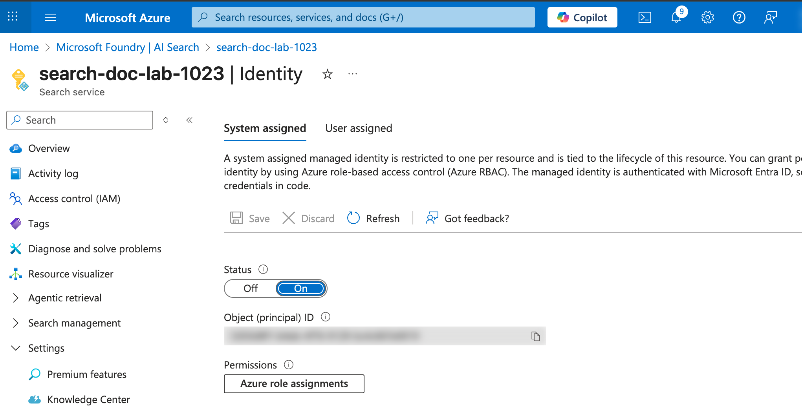
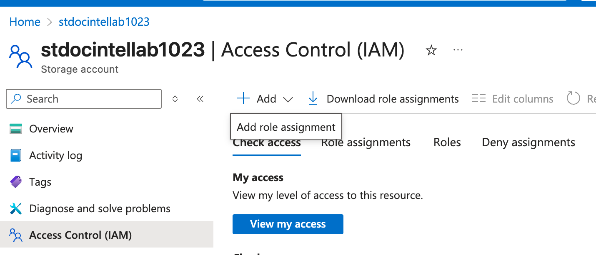
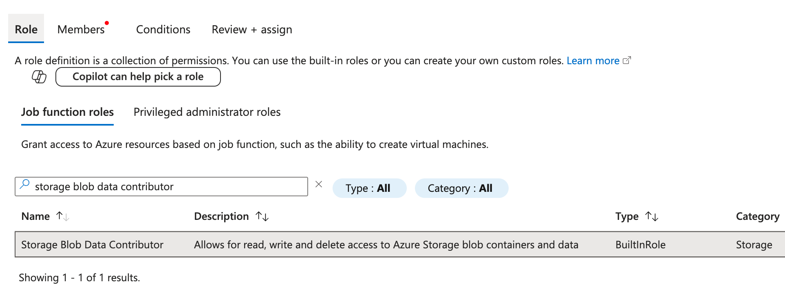
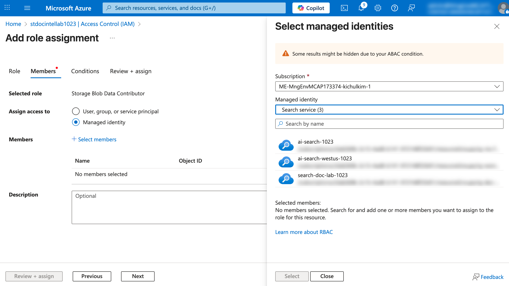
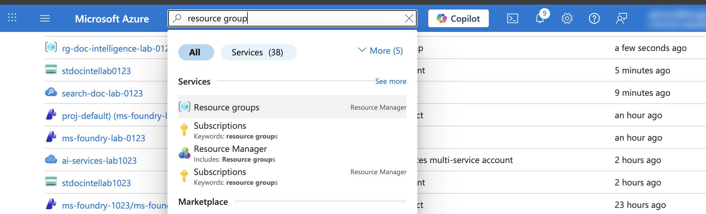
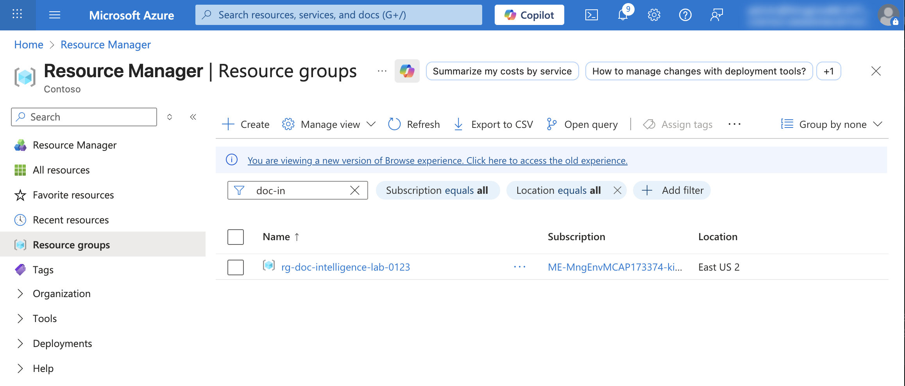
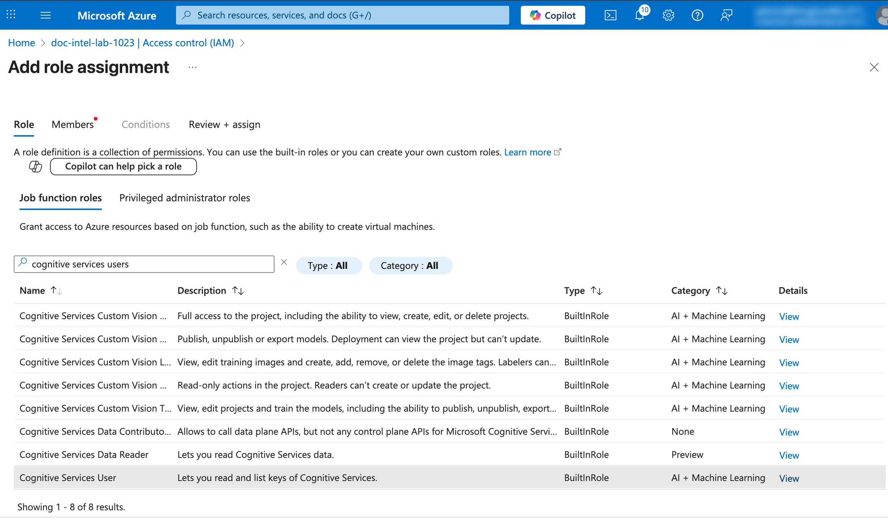
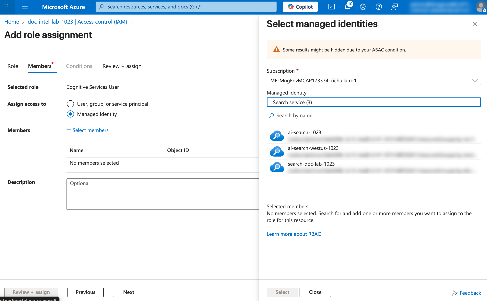
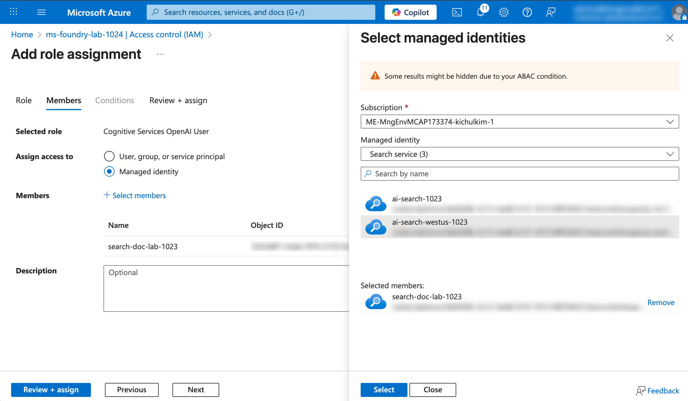

# 02. Microsoft Entra ID 기반 리소스 연동 설정

이 문서에서는 Key 기반 인증 대신 **Microsoft Entra ID** 기반의 역할 기반 접근 제어(RBAC)를 사용하여 Azure 리소스 간 보안 연동을 설정하는 방법을 안내합니다.

## 📋 목차

1. [개요](#1-개요)
2. [AI Search Managed Identity 활성화](#2-ai-search-managed-identity-활성화)
3. [Storage Account에 역할 할당](#3-storage-account에-역할-할당)
4. [Document Intelligence에 역할 할당](#4-document-intelligence에-역할-할당)
5. [Microsoft Foundry에 역할 할당](#5-microsoft-foundry에-역할-할당)
6. [사용자 계정 권한 설정](#6-사용자-계정-권한-설정)
7. [엔드포인트 정보 확인](#7-엔드포인트-정보-확인)
8. [역할 할당 확인](#8-역할-할당-확인)

---

## 1. 개요

> 🔐 **보안 권장사항**: Entra ID 기반 인증은 키 유출 위험이 없고, 세밀한 권한 제어가 가능하며, 감사 로그를 통한 추적이 용이합니다.

### Key 기반 vs Entra ID 기반 인증 비교

| 항목 | Key 기반 | Entra ID 기반 |
|------|----------|---------------|
| 보안성 | 키 유출 위험 있음 | 키 없이 안전한 연동 |
| 권한 관리 | 전체 접근 또는 차단 | 세밀한 역할 기반 제어 |

### 설정할 역할 요약

| 용도 | 리소스 | 할당할 역할 | 대상 |
|------|--------|------------|------|
| AI Search → Blob Storage 문서 읽기/쓰기 | Storage Account | Storage Blob Data Contributor | AI Search |
| AI Search → Document Intelligence 문서 분석 API 호출 | Document Intelligence | Cognitive Services User | AI Search |
| AI Search → GPT-4o/Embedding 모델 호출 | Microsoft Foundry | Cognitive Services OpenAI User | AI Search |
| 사용자 → Blob Storage 문서 읽기/쓰기 | Storage Account | Storage Blob Data Contributor | 사용자 계정 |

---

## 2. AI Search Managed Identity 활성화

AI Search가 다른 Azure 리소스에 안전하게 접근할 수 있도록 System Managed Identity를 활성화합니다.

### 단계별 가이드

1. **AI Search 리소스로 이동**
   - Azure Portal에서 앞서 생성한 AI Search 서비스로 이동

2. **Identity 메뉴 이동**
   - 왼쪽 메뉴에서 `Settings` > `Identity` 클릭

3. **System assigned Identity 활성화**
   - `System assigned` 탭 선택
   - Status를 `On`으로 변경

4. **Save 클릭**

<kbd>

</kbd>

---

## 3. Storage Account에 역할 할당

AI Search가 Blob Storage의 문서를 읽고, Knowledge Store에 데이터를 저장할 수 있도록 역할을 할당합니다. 또한 사용자도 Blob Storage에 접근할 수 있도록 권한을 부여합니다.

> 💡 **참고**: Storage Blob Data Contributor 역할은 읽기와 쓰기 권한을 모두 포함하므로, 하나의 역할만 할당하면 됩니다.

### 단계별 가이드

1. **Storage Account로 이동**
   - Azure Portal에서 앞서 생성한 Storage Account로 이동

2. **Access Control (IAM) 메뉴 이동**
   - 왼쪽 메뉴에서 `Access Control (IAM)` 클릭

3. **역할 할당 추가**
   - `+ Add` > `Add role assignment` 클릭

<kbd>

</kbd>

4. **Role 탭에서 역할 선택**
   - 검색창에 "Storage Blob Data Contributor" 입력
   - `Storage Blob Data Contributor` 선택
   - `Next` 클릭

   | 역할 | 권한 |
   |------|------|
   | Storage Blob Data Contributor | Blob 데이터 읽기/쓰기 |

<kbd>

</kbd>

5. **Members 탭에서 멤버 추가**
    - User 계정 추가
      - `Assign access to`: **User, group, or service principal** 선택
      - `+ Select members` 클릭
      - 본인 계정 검색 및 선택
      - `Select` 클릭
    - AI Search 추가
      - `Assign access to`: **Managed identity** 선택
      - `+ Select members` 클릭
      - `Managed identity` 드롭다운에서 **Search service** 선택
      - 앞서 생성한 AI Search 서비스 선택 (search-doc-lab-[고유번호])
      - `Select` 클릭

<kbd>

</kbd>

1. **Review + assign 클릭하여 역할 할당 완료**

---

## 4. Document Intelligence에 역할 할당

AI Search가 Document Intelligence를 사용할 수 있도록 역할을 할당합니다.

### 단계별 가이드

1. **Document Intelligence 리소스로 이동**
   
   1. (Skip, 2번 진행)  **Resource Group 으로 이동 후 앞서 생성한 Document Intelligence 리소스를 선택**

      <kbd>
      
      </kbd>

      <kbd>
      
      </kbd>

      <kbd>
      
      </kbd>

   2. **Azure Portal의 Resources 에서 Azure AI services multi-serivce account 리소스로 이동**
    
      <kbd>
      
      </kbd>

2. **Access Control (IAM) 메뉴 이동**
   - 왼쪽 메뉴에서 `Access Control (IAM)` 클릭

3. **역할 할당 추가**
   - `+ Add` > `Add role assignment` 클릭

4. **Role 탭에서 역할 선택**
   - 검색창에 "Cognitive Services User" 입력
   - `Cognitive Services User` 선택
   - `Next` 클릭

   | 역할 | 권한 |
   |------|------|
   | Cognitive Services User | API 호출 권한 |

   <kbd>
   
   </kbd>

5. **Members 탭에서 AI Search 추가**
   - `Assign access to`: **Managed identity** 선택
   - `+ Select members` 클릭
   - `Managed identity` 드롭다운에서 **Search service** 선택
   - 앞서 생성한 AI Search 서비스 선택
   - `Select` 클릭

   <kbd>
   
   </kbd>

6. **Review + assign 클릭하여 역할 할당 완료**

---

## 5. Microsoft Foundry에 역할 할당

AI Search가 Microsoft Foundry의 GPT-4o 및 text-embedding-3-large 모델을 호출할 수 있도록 역할을 할당합니다.

> 💡 **참고**: 이 설정은 AI Search에서 벡터 검색(임베딩) 및 이미지 캡션 추출 기능을 사용할 때 필요합니다.

### 단계별 가이드

1. **Microsoft Foundry 리소스로 이동**
   - Azure Portal에서 검색창에 Microsoft Foundry 검색 후 이동
   - 왼쪽 메뉴 탭에서 Use with Foundry - Foundry 클릭
   - 앞서 생성했던 Foundry 리소스 클릭

2. **Access Control (IAM) 메뉴 이동**
   - 왼쪽 메뉴에서 `Access Control (IAM)` 클릭

3. **역할 할당 추가**
   - `+ Add` > `Add role assignment` 클릭

4. **Role 탭에서 역할 선택**
   - 검색창에 "Cognitive Services OpenAI User" 입력
   - `Cognitive Services OpenAI User` 선택
   - `Next` 클릭

   | 역할 | 권한 |
   |------|------|
   | Cognitive Services OpenAI User | 모델 배포 읽기 및 추론 작업 |

   <kbd>
   
   </kbd>

5. **Members 탭에서 멤버 추가**
   - `Assign access to`: **Managed identity** 선택
   - `+ Select members` 클릭
   - `Managed identity` 드롭다운에서 **Search service** 선택
   - 앞서 생성한 AI Search 서비스 선택
   - `Select` 클릭

   <kbd>
   
   </kbd>

6. **Review + assign 클릭하여 역할 할당 완료**

---

## 6. (Skip) 사용자 계정 권한 설정

로컬 개발 환경에서 직접 API를 테스트하려면 본인 계정에도 권한이 필요합니다.

> 🔐 **참고**: 이 설정은 Azure CLI나 SDK를 통해 직접 API를 호출할 때 필요합니다.

### 6.1 Document Intelligence에 사용자 권한 할당

1. **Document Intelligence 리소스로 이동**
2. **Access Control (IAM) > `+ Add` > `Add role assignment`**
3. **Role 탭**: `Cognitive Services User` 선택
4. **Members 탭**:
   - `Assign access to`: **User, group, or service principal** 선택
   - `+ Select members` 클릭
   - 본인 계정 검색 및 선택
5. **Review + assign 클릭**

### 6.2 Microsoft Foundry에 사용자 권한 할당

1. **Microsoft Foundry Hub 리소스로 이동**
2. **Access Control (IAM) > `+ Add` > `Add role assignment`**
3. **Role 탭**: `Cognitive Services OpenAI User` 선택
4. **Members 탭**:
   - `Assign access to`: **User, group, or service principal** 선택
   - `+ Select members` 클릭
   - 본인 계정 검색 및 선택
5. **Review + assign 클릭**

---

## ✅ 체크리스트

Entra ID 설정이 완료되었는지 확인하세요:

- [ ] AI Search Managed Identity 활성화 완료
- [ ] Storage Account에 Storage Blob Data Contributor 역할 할당 완료 (AI Search)
- [ ] Document Intelligence에 Cognitive Services User 역할 할당 완료 (AI Search)
- [ ] Microsoft Foundry에 Cognitive Services OpenAI User 역할 할당 완료 (AI Search)
- [ ] Document Intelligence에 Cognitive Services User 역할 할당 완료 (사용자 계정)
- [ ] Microsoft Foundry에 Cognitive Services OpenAI User 역할 할당 완료 (사용자 계정)
- [ ] 역할 할당 목록에서 AI Search 및 사용자 계정 확인 완료

---

## 🔜 다음 단계

Entra ID 기반 리소스 연동 설정이 완료되면 다음 튜토리얼에서 Document Intelligence를 통해 문서에서 컨텐츠를 추출하는 방법을 학습합니다.

➡️ [03. Document Intelligence로 컨텐츠 추출하기](./03-doc-intel-extract.md)

---

## 🆘 문제 해결

### Q: Managed Identity를 찾을 수 없습니다.
**A:** AI Search의 Identity 설정에서 System assigned가 `On`으로 설정되어 있는지 확인하세요. Save 후 몇 초 기다려야 합니다.

### Q: 역할 할당 후에도 접근이 안 됩니다.
**A:** 역할 할당이 적용되기까지 최대 5분이 소요될 수 있습니다. 잠시 기다린 후 다시 시도하세요.

### Q: 구독에 대한 권한이 없다고 나옵니다.
**A:** 역할 할당을 위해서는 해당 리소스에 대한 Owner 또는 User Access Administrator 권한이 필요합니다. 관리자에게 문의하세요.
