# 03. Document Intelligence로 컨텐츠 추출하기

이 문서에서는 Azure Document Intelligence를 사용하여 PDF, 이미지 등 다양한 문서에서 텍스트와 구조 정보를 추출하는 방법을 안내합니다.

## 📋 목차

1. [개요](#1-개요)
2. [테스트 문서 준비](#2-테스트-문서-준비)
3. [Azure Portal에서 Document Intelligence Studio 접속](#3-azure-portal에서-document-intelligence-studio-접속)
4. [OCR/Read 모델로 텍스트 추출](#4-ocrread-모델로-텍스트-추출)
5. [Layout 모델로 문서 분석](#5-layout-모델로-문서-분석)
6. [분석 결과 확인](#6-분석-결과-확인)

---

## 1. 개요

### Document Intelligence란?

Azure Document Intelligence는 AI 기반 문서 처리 서비스로, 다양한 형식의 문서에서 텍스트, 테이블, 구조 정보를 자동으로 추출합니다.

### 지원하는 문서 형식

| 형식 | 확장자 |
|------|--------|
| PDF | `.pdf` |
| 이미지 | `.jpg`, `.jpeg`, `.png`, `.bmp`, `.tiff`, `.heif` |
| Office | `.docx`, `.xlsx`, `.pptx`, `.html` |

### 주요 분석 모델

| 모델 | 용도 | 특징 |
|------|------|------|
| **OCR/Read** | OCR 텍스트 추출 | 가장 빠름, 텍스트만 추출 |
| **Layout** | 문서 구조 분석 | 텍스트 + 테이블 + 레이아웃 |
| **Prebuilt-document** | 일반 문서 | 키-값 쌍 추출 |
| **Prebuilt-invoice** | 송장/인보이스 | 특화된 필드 추출 |
| **Prebuilt-receipt** | 영수증 | 영수증 특화 |

---

## 2. 테스트 문서 준비

### 2.1 샘플 문서 다운로드

실습을 위해 샘플 PDF 문서를 준비합니다.

**샘플 파일 다운로드**:
- [Accelerating Sustainability with AI PDF](https://github.com/Azure-Samples/azure-search-sample-data/blob/main/sustainable-ai-pdf/Accelerating-Sustainability-with-AI-2025.pdf)

> 💡 **팁**: 본인의 PDF 문서를 사용해도 됩니다.

---

## 3. Document Intelligence Studio 접속

### 3.1 (Skip) Document Intelligence 리소스로 이동

1. **Azure Portal에서 Document Intelligence 리소스로 이동**
2. **Overview 페이지에서 `Go to Document Intelligence Studio` 링크 클릭**

    <kbd>
    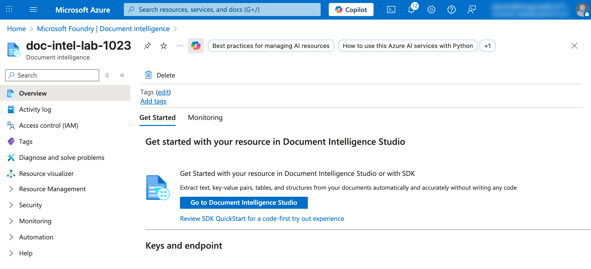
    </kbd>

---

## 4. Azure AI Services 에서 Document Intelligence Studio 접속

### 4.1 Azure AI Services 리소스로 이동

1. **Azure Portal의 Resources 에서 Azure AI services multi-serivce account 리소스로 이동**

    <kbd>
    
    </kbd>

2. **Overview 페이지에서 `Document Intelligence` 링크 클릭**

    <kbd>
    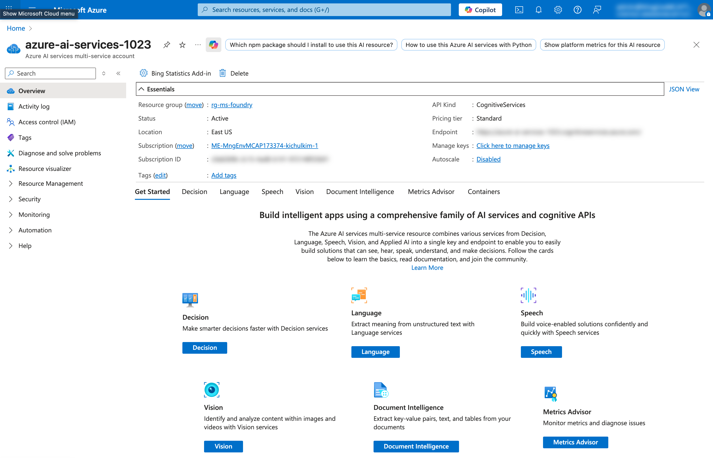
    </kbd>

3. **`Document Intelligence Studio` 링크 클릭**

    <kbd>
    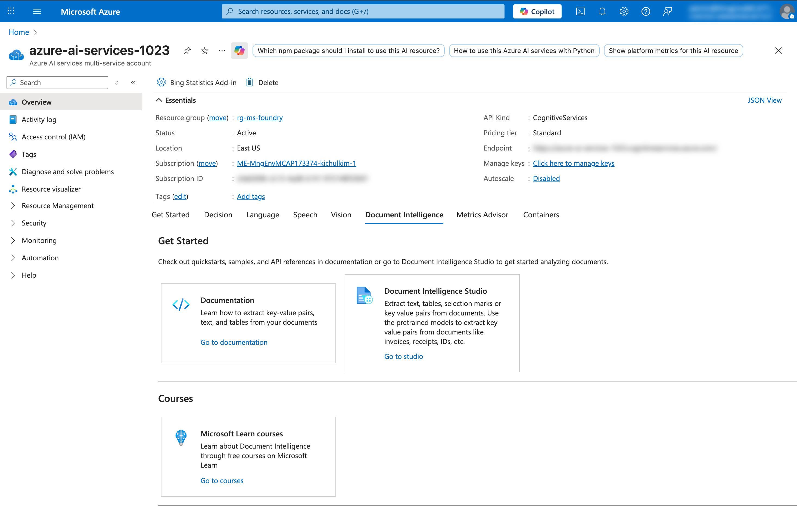
    </kbd>

---

## 5. 모델 선택 화면

1. **Document Intelligence Studio가 새 탭에서 열림**
2. **Start with Document Intelligence 클릭**
   
   (필요시 Azure 계정으로 로그인)
3. **다양한 Document analysis 모델 목록이 표시됨**
   - OCR/Read
   - Layout
   - Prebuilt models (Invoice, Receipt 등)
   - Custom models

    <kbd>
    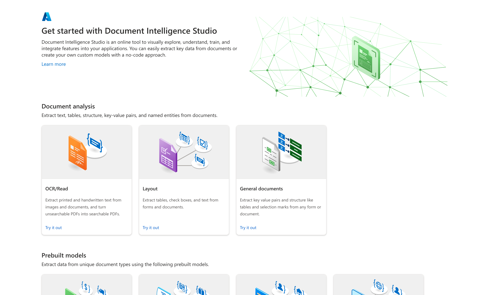
    </kbd>

## 6. OCR/Read 모델로 텍스트 추출

OCR/Read 모델은 순수 OCR 기능으로, 텍스트만 빠르게 추출할 때 가장 적합합니다.

### 6.1 OCR/Read 모델 선택

1. **Document Intelligence Studio 메인 화면에서 `OCR/Read` 선택**

    <kbd>
    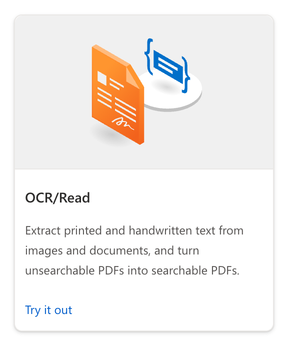
    </kbd>

    (리소스를 찾을 수 없다는 메세지가 나오면 앞서 생성한 리소스를 연결합니다.)

    <kbd>
    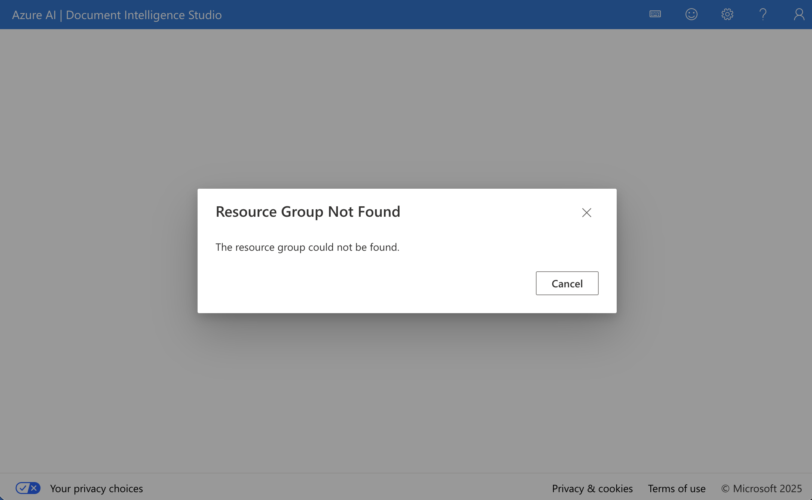
    </kbd>

    <kbd>
    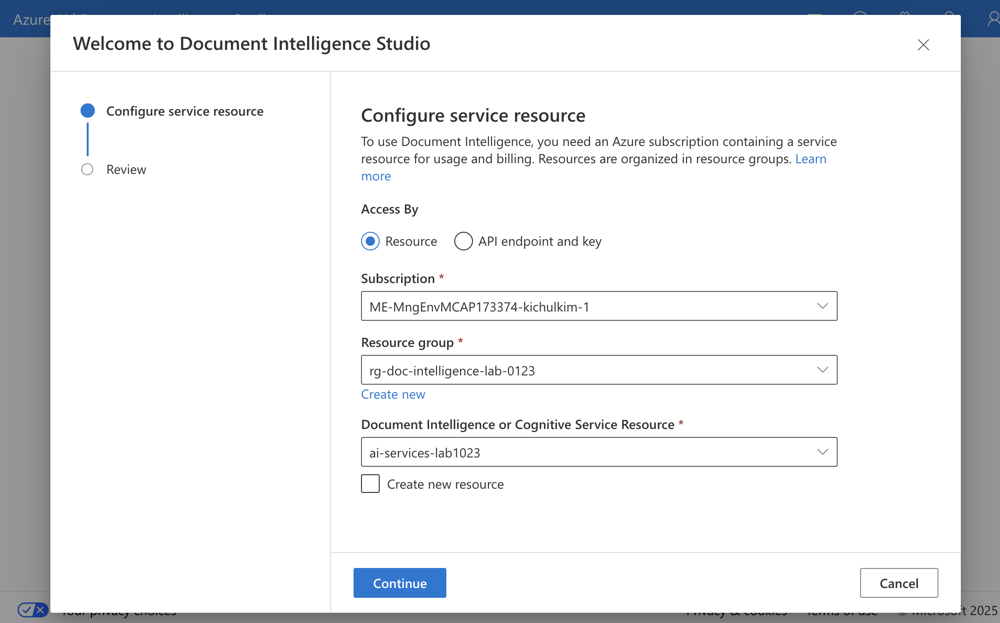
    </kbd>

2. **앞서 생성한 리소스 그룹과 리소스를 선택한 후 `Finish` 클릭**

### 6.2 문서 업로드 및 분석

1. **왼쪽 패널에서 파일 업로드**
   - `Drag & drop file here` 영역에 파일 드래그 앤 드롭
   - 또는 `Browse for files` 클릭하여 파일 선택
   - 또는 `Fetch from URL`로 URL에서 가져오기

2. **Analyze options 설정 (선택사항)**
   - `Analyze options` 버튼 클릭
   - **Run analysis range**: Current document / All documents
   - **Page range**: All pages / Range (특정 페이지만 분석)
   - **Optional output**: Searchable PDF (검색 가능한 PDF 출력)
   - **Optional detection**: Barcodes, Language
   - **Premium detection**: High resolution, Style font, Formulas

    <kbd>
    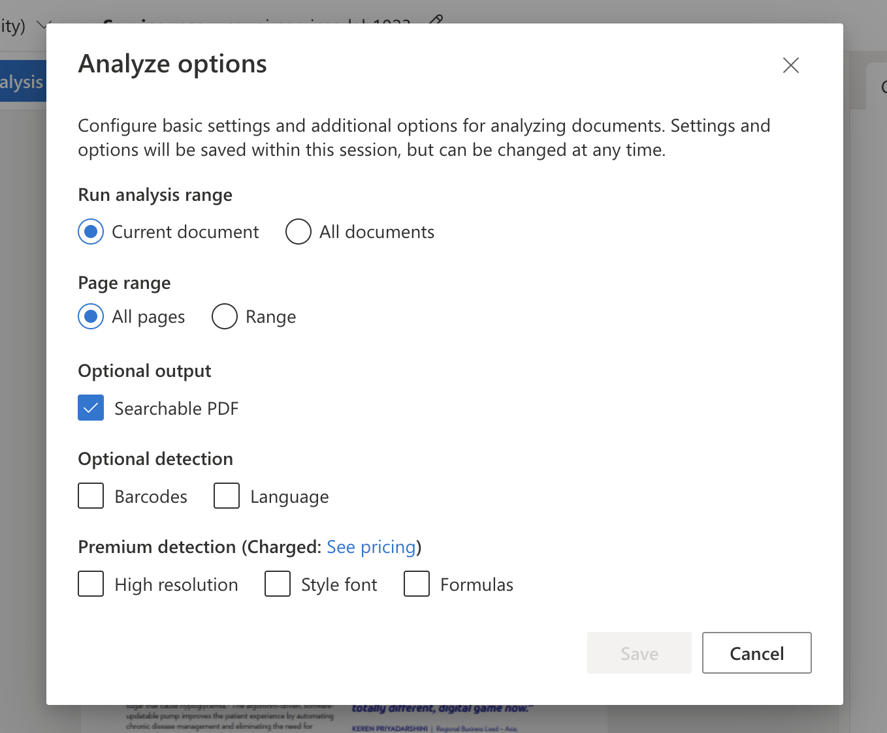
    </kbd>

3. **`Run analysis` 버튼 클릭**
    <kbd>
    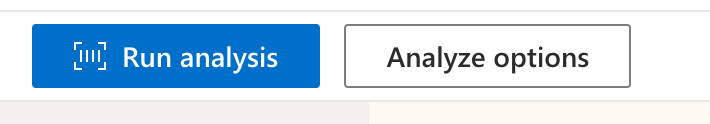
    </kbd>

### 6.3 OCR/Read 결과 확인

1. **Content 탭에서 추출된 텍스트 확인**

    <kbd>
    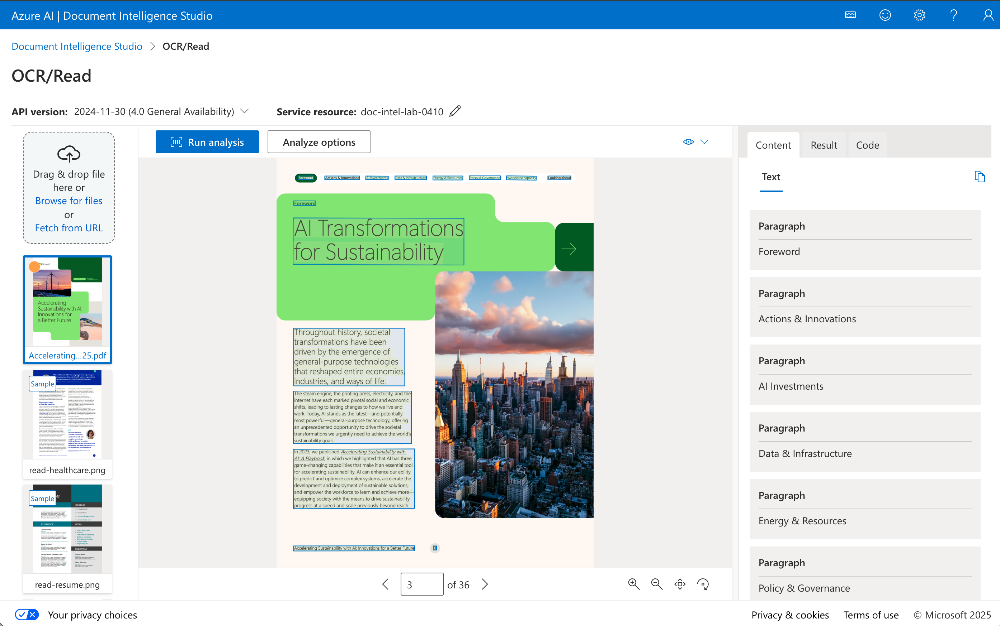
    </kbd>

> 💡 **참고**: OCR/Read 모델은 테이블이나 레이아웃 정보를 추출하지 않습니다. 텍스트만 필요한 경우 가장 빠른 옵션입니다.

---

## 7. Layout 모델로 문서 분석

Layout 모델은 문서의 텍스트, 테이블, 체크박스, 구조 정보를 추출하는 데 가장 적합합니다.

### 7.1 Layout 모델 선택

1. **Document Intelligence Studio 메인 화면에서 `Layout` 선택**

    <kbd>
    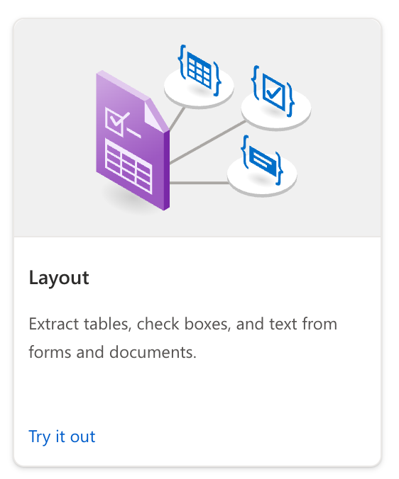
    </kbd>

### 7.2 문서 업로드 및 분석

1. **왼쪽 패널에서 파일 업로드**
   - `Drag & drop file here` 영역에 파일 드래그 앤 드롭
   - 또는 `Browse for files` 클릭하여 파일 선택
   - 또는 `Fetch from URL`로 URL에서 가져오기

2. **Analyze options 설정 (선택사항)**
   - `Analyze options` 버튼 클릭
   - **Run analysis range**: Current document / All documents
   - **Page range**: All pages / Range (특정 페이지만 분석)
   - **Output format style**: Text / Markdown (Markdown 선택 권장)
   - **Optional output**: Figure image
   - **Optional detection**: Barcodes, Language, Key-value pairs
   - **Premium detection**: High resolution, Style font, Formulas

    <kbd>
    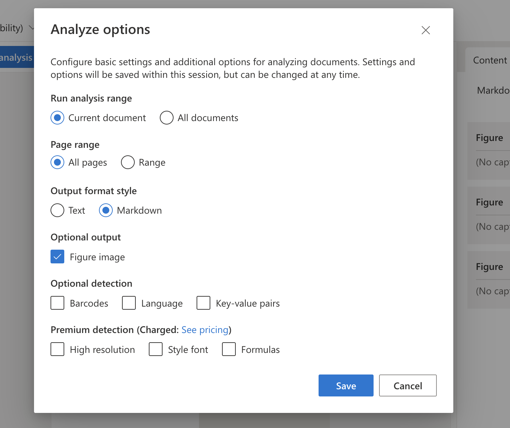
    </kbd>

3. **`Run analysis` 버튼 클릭**
   
    <kbd>
    
    </kbd>

### 7.3 Layout 결과 확인
1. **Content 탭에서 추출된 Markdown 확인**

    <kbd>
    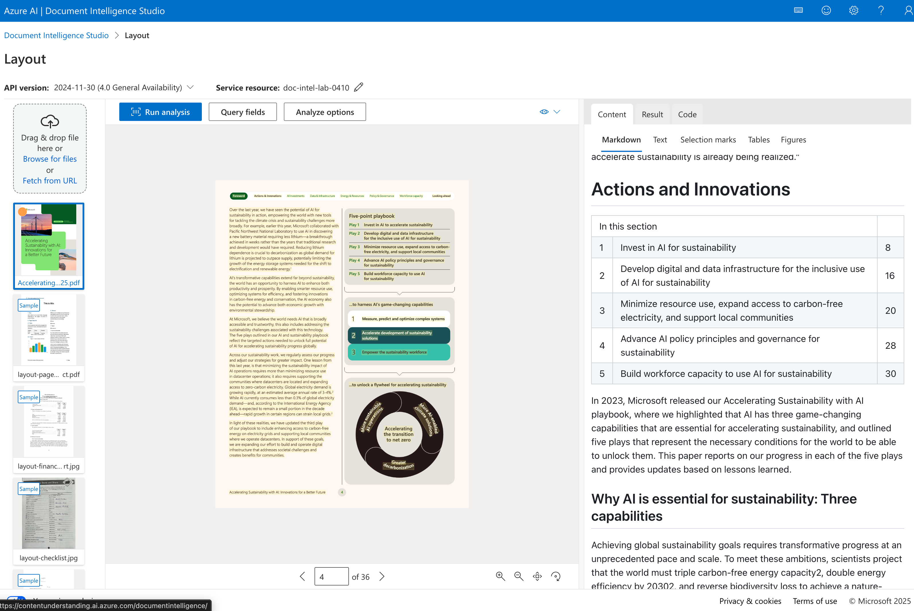
    </kbd>

2. **Content 탭에서 추출된 테이블 확인**

    <kbd>
    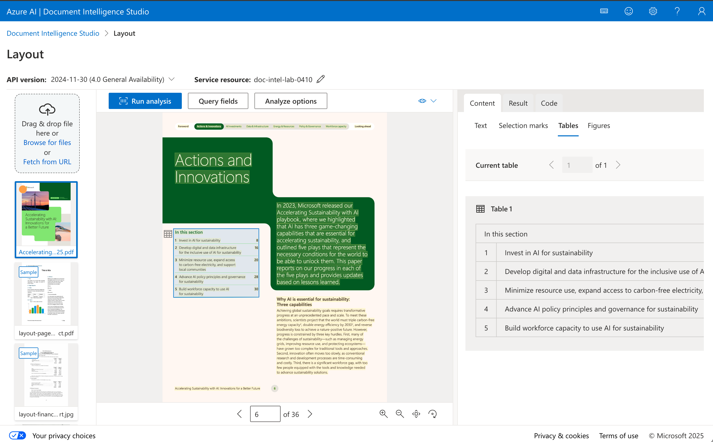
    </kbd>

---

## ✅ 체크리스트

Document Intelligence 컨텐츠 추출 실습이 완료되었는지 확인하세요:

- [ ] 테스트 문서 로컬에 다운로드 완료
- [ ] Document Intelligence Studio 접속 완료
- [ ] OCR/Read 모델로 텍스트 추출 실행 완료
- [ ] Layout 모델로 문서 분석 실행 완료
- [ ] 추출된 텍스트 결과 확인 완료
- [ ] Markdown 추출 결과 확인 완료
- [ ] 테이블 추출 결과 확인 완료

---

## 🔜 다음 단계

Document Intelligence로 문서 분석을 경험했다면, 다음 튜토리얼에서 AI Search와 연동하여 대량의 문서를 자동으로 인덱싱하는 방법을 학습합니다.

➡️ [04. AI Search로 문서 인덱싱하기](./04-aisearch-indexing.md)

---

## 🆘 문제 해결

### Q: Document Intelligence Studio에 접속할 수 없습니다.
**A:** Azure Portal에서 Document Intelligence 리소스의 Overview 페이지에서 Studio 링크를 클릭하거나, 직접 https://documentintelligence.ai.azure.com 에 접속하세요.

### Q: 리소스 연결 시 Document Intelligence가 보이지 않습니다.
**A:** Settings에서 올바른 Subscription과 Resource group을 선택했는지 확인하세요.

### Q: 분석 결과가 정확하지 않습니다.
**A:** 문서 품질(해상도, 스캔 상태)을 확인하세요. 고해상도 문서일수록 더 정확한 결과를 얻을 수 있습니다.
