# 04. AI Search로 문서 인덱싱하기

이 문서에서는 Azure AI Search의 **Import data (new)** 기능의 **Multimodal RAG** 옵션을 사용하여 Document Intelligence와 연동하고, Blob Storage의 문서를 간편하게 인덱싱하는 방법을 안내합니다.

## 📋 목차

1. [개요](#1-개요)
2. [인덱싱 아키텍처 이해](#2-인덱싱-아키텍처-이해)
3. [Import data (new) 마법사 시작](#3-import-data-new-마법사-시작)
4. [Connect to your data](#4-connect-to-your-data)
5. [Content extraction](#5-content-extraction)
6. [Content embedding](#6-content-embedding)
7. [Image output](#7-image-output)
8. [Advanced settings](#8-advanced-settings)
9. [Review and create](#9-review-and-create)
10. [인덱싱 결과 확인](#10-인덱싱-결과-확인)

---

## 1. 개요

### Import data (new) 란?

Azure AI Search의 **Import data (new)** 는 인덱싱 설정을 간소화한 새로운 마법사입니다. **Multimodal RAG** 옵션을 통해 Document Intelligence, Azure OpenAI 임베딩 등을 한 번에 쉽게 연동할 수 있습니다.

## 2. 인덱싱 아키텍처 이해

<kbd>

</kbd>

---

## 3 샘플 문서 업로드

### 3.1 **문서 업로드**
  
   - 샘플 파일 다운로드:
     - [Health Plan 문서](https://github.com/Azure-Samples/azure-search-sample-data/tree/main/health-plan)
     - [Accelerating Sustainability with AI PDF](https://github.com/Azure-Samples/azure-search-sample-data/blob/main/sustainable-ai-pdf/Accelerating-Sustainability-with-AI-2025.pdf)

        > 💡 **팁**: 본인의 PDF 문서를 사용해도 됩니다.

   - 샘플 파일 업로드:
     - Azure Portal에서 앞서 생성한 Storage Account (`stdocintellab[고유번호]`)로 이동
      - 왼쪽 메뉴에서 `Data Storage` 에서 `Containers` 클릭
      - `documents` 컨테이너 클릭
      - `Upload` 버튼 클릭
      - `파일 선택` 클릭하여 샘플 PDF 파일 업로드 

   - 업로드 확인 :
<kbd>
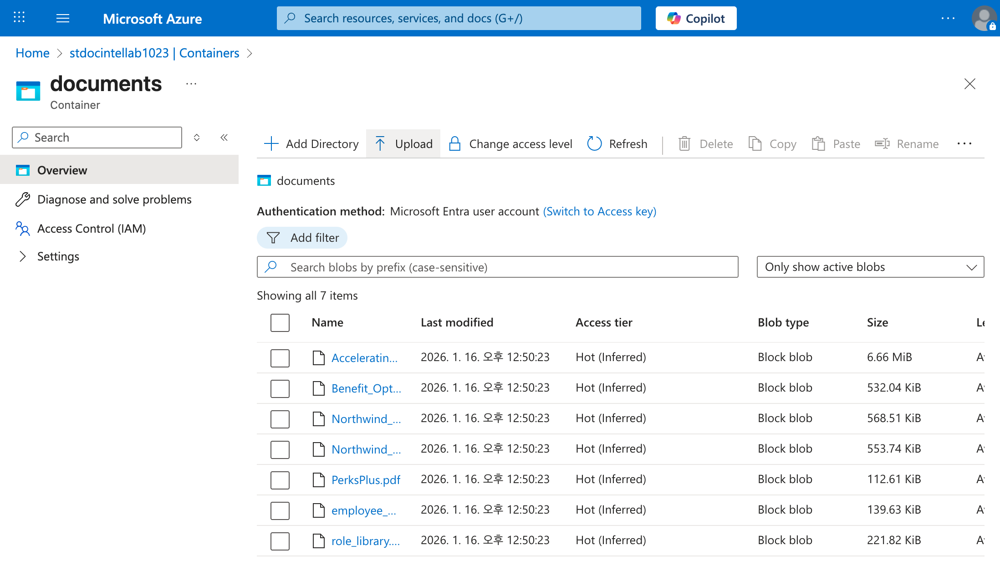
</kbd>

---   

## 4. Import data (new) 마법사 시작

### 4.1 AI Search 리소스로 이동

1. **Azure Portal > AI Search 리소스로 이동**
2. **Overview 페이지 확인**

### 4.2 Import data (new) 시작

1. **상단 메뉴에서 `Import data (new)` 클릭**

   > ⚠️ **주의**: `Import data`가 아닌 **`Import data (new)`** 를 선택하세요.

<kbd>
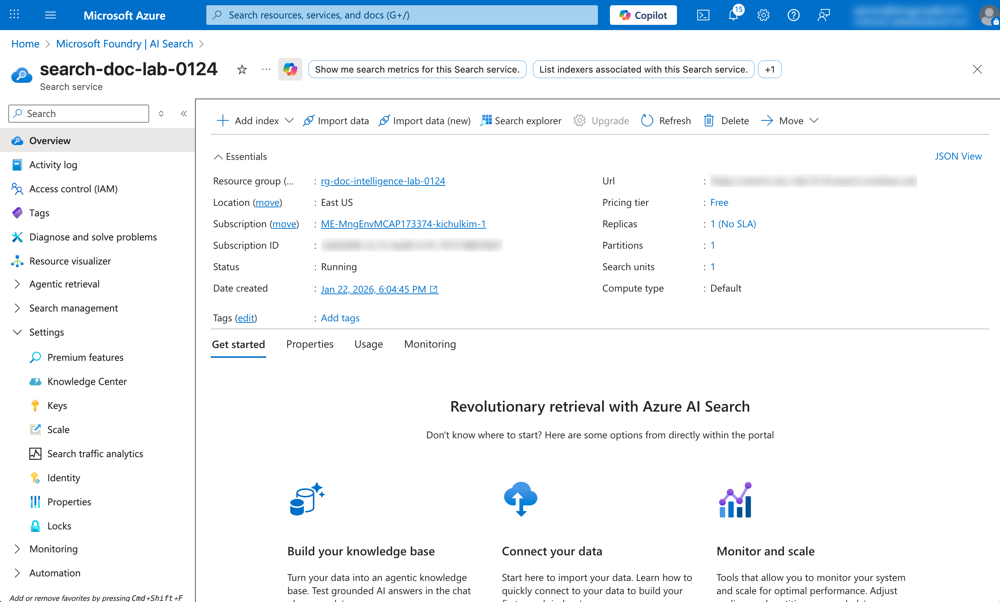
</kbd>

2. **Data Source 선택**
   - 여러 옵션 중 **Azure Blob Storage** 선택

<kbd>
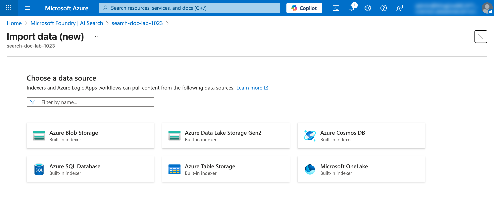
</kbd>

3. **Multimodal RAG 선택**
   - 여러 옵션 중 **Multimodal RAG** 선택

   > 💡 **Multimodal RAG**: Document Intelligence를 사용하여 PDF에서 텍스트/테이블/이미지 등을 추출하고, Azure OpenAI로 벡터 임베딩 및 이미지 캡션을 생성합니다.

<kbd>
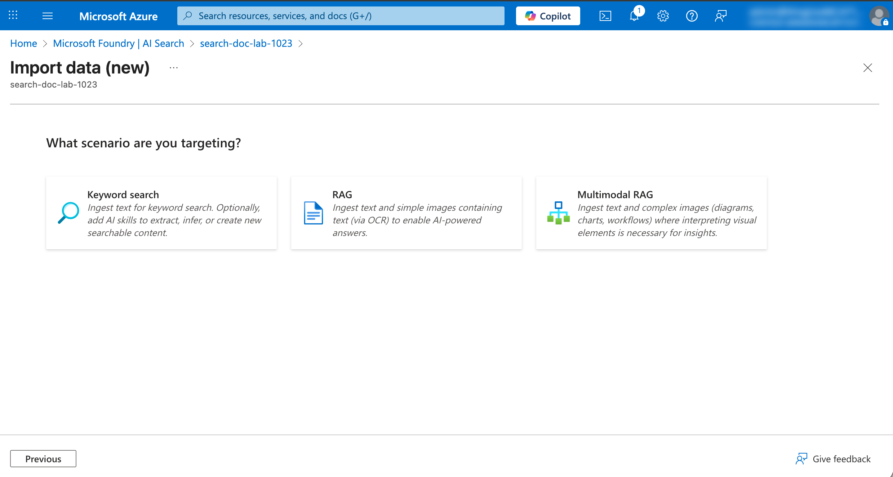
</kbd>

---

## 5. Connect to your data

데이터 소스를 설정합니다.

### 5.1 데이터 소스 설정
1. **다음 정보 입력**:

   | 필드 | 값 | 설명 |
   |------|-----|------|
   | Subscription | 본인 구독 선택 | Azure 구독 |
   | Storage account | `stdocintellab[고유번호]` | 생성한 Storage Account |
   | Blob Container | `documents` | Blob 컨테이너 |
   | Blob folder | `[공란]` | Blob 폴더 |

2. **Managed Identity 인증**
   - `Authentication using managed identity` 선택
   - `Managed identity type`: **System-assigned** 선택

<kbd>
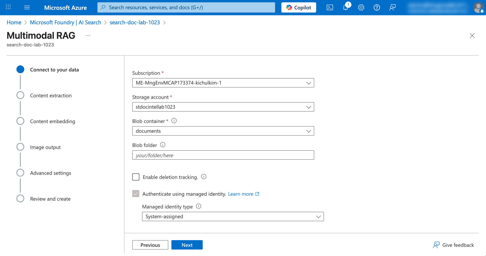
</kbd>

3. **Next** 클릭

---

## 6. Content extraction

Document Intelligence를 사용하여 문서에서 콘텐츠를 추출합니다.

### 6.1 AI Document Intelligence 연결

1. **다음 정보 선택**:
   - AI Document Intelligence 선택
  
   | 필드 | 값 | 설명 |
   |------|-----|------|
   | Subscription | 본인 구독 | Azure 구독 |
   | Select a multi-service account | `ai-services-[고유번호]` | 생성한 리소스 |
   | Authentication type | `System-assigned` | Entra ID 기반 접근 |

<kbd>
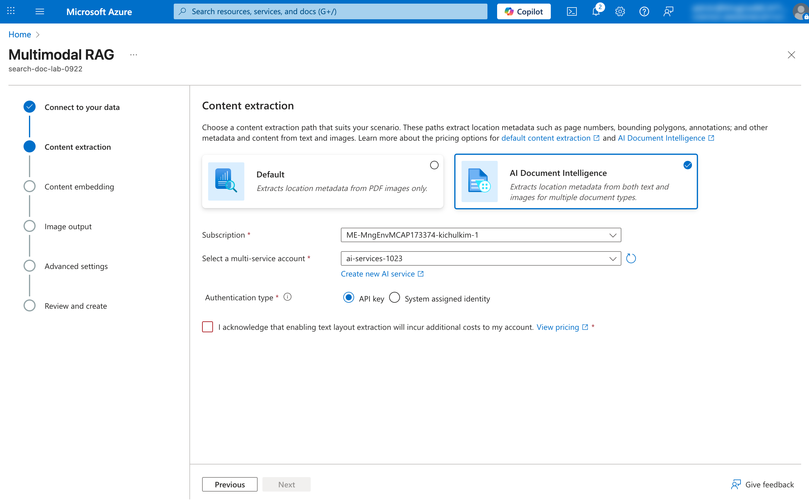
</kbd>

2. **Next** 클릭

---

## 7. Content embedding

Azure AI Foundry 를 사용하여 이미지에서 캡션을 생성하고 텍스트를 벡터 임베딩으로 변환합니다.

### 7.1 Image Verbalization 구성

이미지에서 텍스트 설명(캡션) 을 생성하고, 이 캡션을 인덱싱에 포함시킵니다.

1. **Image Verbalization 정보 선택**:

   | 필드 | 값 | 설명 |
   |------|-----|------|
   | Kind | Azure AI Foundry (Preview) | 모델 제공 서비스 |
   | Subscription | 본인 구독 | Azure 구독 |
   | Azure AI Foundry/Hub project | `project-default (ms-foundry-lab-[고유번호])` | Microsoft Foundry 프로젝트 |
   | Model deployment | `gpt-4o` | 멀티모달 모델 |

<kbd>
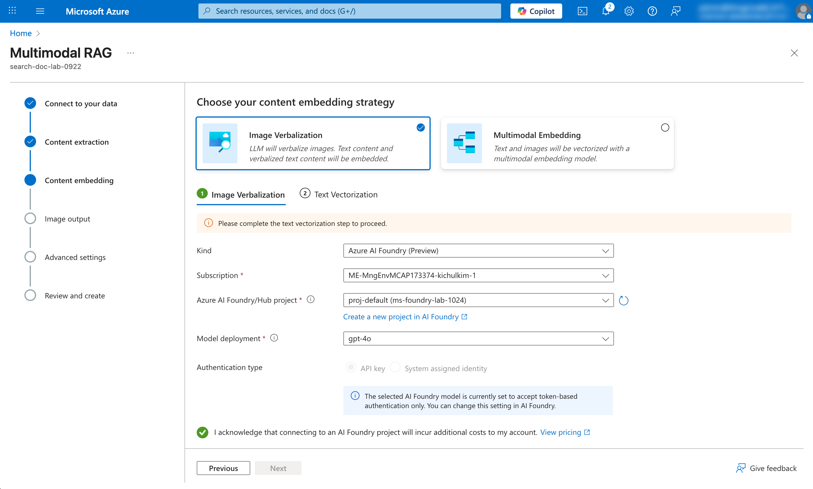
</kbd>

2. **Text Vectorization 정보 선택**:

   | 필드 | 값 | 설명 |
   |------|-----|------|
   | Kind | Azure AI Foundry (Preview) | 모델 제공 서비스 |
   | Subscription | 본인 구독 | Azure 구독 |
   | Azure AI Foundry/Hub project | `project-default (ms-foundry-lab-[고유번호])` | Microsoft Foundry 프로젝트 |
   | Model deployment | `text-embedding-3-large` | 임베딩 모델 |

<kbd>
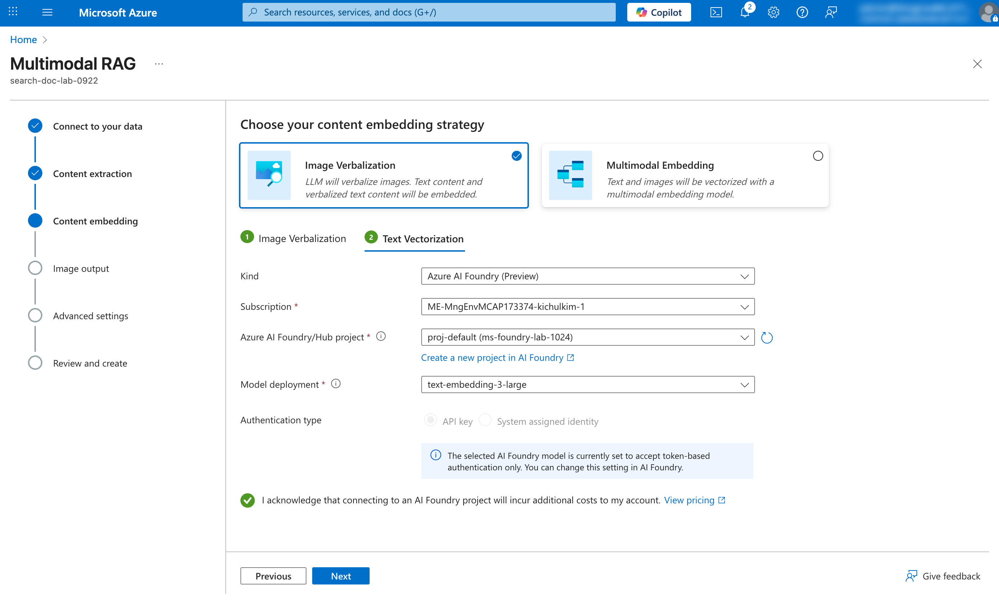
</kbd>

3. **Next** 클릭

---

## 8. Image output

문서에서 추출한 이미지가 저장될 위치를 지정합니다.

### 8.1 Image output location 설정

1. **다음 정보 선택**:

   | 필드 | 값 | 설명 |
   |------|-----|------|
   | Subscription | 본인 구독 | Azure 구독 |
   | Storage account | `stdocintellab[고유번호]` | Storage Account |
   | Blob container | `output` | Blob 컨테이너 |

<kbd>
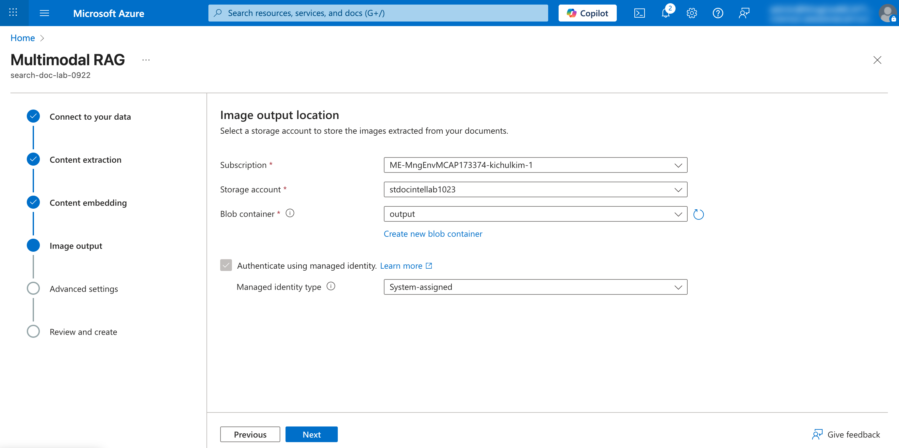
</kbd>

2. **Next** 클릭

---

## 9. Advanced settings

### 9.1 인덱스 설정
1. **다음 정보 입력**:

   | 필드 | 값 | 설명 |
   |------|-----|------|
   | Enable semantic ranker | ✅ 체크 | 시맨틱 검색 활성화 |
   | Schedule indexing | Once | 1회만 실행 |

<kbd>

</kbd>

2. **Next** 클릭

---

## 10. Review and create

설정을 검토하고 인덱싱을 시작합니다.

### 10.1 설정 검토 및 인덱스 생성
1. **모든 설정 확인**:
2. **`Create`** 버튼 클릭
3. **인덱싱이 자동으로 시작됨**

<kbd>
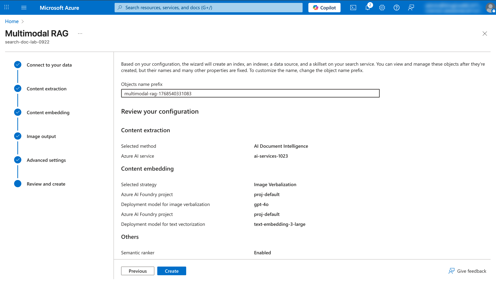
</kbd>

---

## 11. 인덱싱 결과 확인

### 11.1 생성된 리소스 확인

Import data (new)가 자동으로 생성하는 리소스:

| 리소스 | 이름 예시 | 설명 |
|--------|----------|------|
| Index | `idx-documents` | 검색 인덱스 |
| Indexer | `idxr-documents` | 인덱싱 실행기 |
| Data Source | `multimodal-rag-1234` | Blob Storage 연결 |
| Skillset | `multimodal-rag-1234-skillset` | Document Intelligence + 임베딩 + 이미지 캡션 |

### 11.2 인덱서 실행 상태 확인

1. **AI Search > Indexers 메뉴 클릭**
2. **생성된 인덱서 클릭하여 상태 확인**

   | 상태 | 설명 |
   |------|------|
   | In progress | 실행 중 |
   | Success | 완료 |
   | Failed | 실패 |

<kbd>
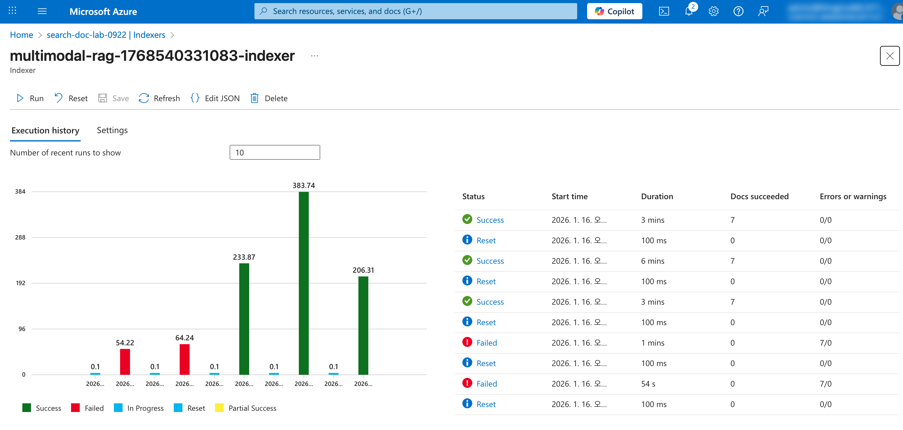
</kbd>

### 11.3 인덱스 검색 테스트

1. **Overview > Search explorer 메뉴 클릭** 혹은 **Indexes >생성된 Index 클릭**
2. **간단한 검색 쿼리 테스트**:
   검색어: `sustainability`

3. **Search 클릭하여 결과 확인**

<kbd>
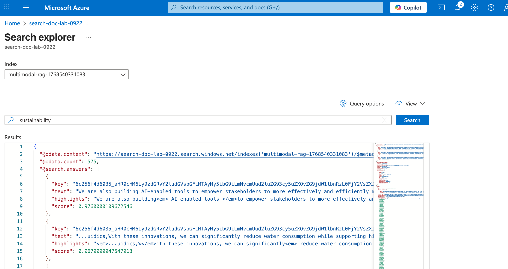
</kbd>

### 11.4 이미지 캡션 확인

1. GPT-4o가 생성한 이미지 캡션이 인덱스에 저장되었는지 확인:
검색어: `geometric structure`

<kbd>
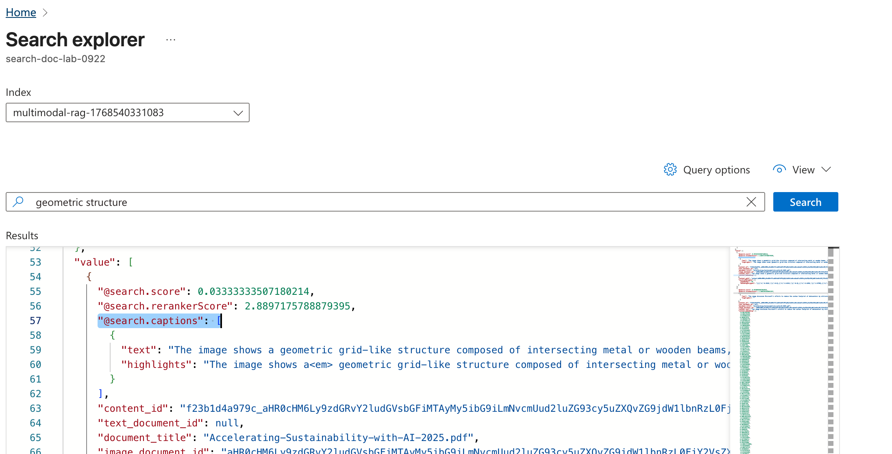
</kbd>

---

## ✅ 체크리스트

AI Search 인덱싱이 완료되었는지 확인하세요:

- [ ] Import data (new) 마법사 시작 완료
- [ ] Multimodal RAG 옵션 선택 완료
- [ ] Connect to your data - Blob Storage 연결 완료
- [ ] Content extraction - Document Intelligence 연결 완료
- [ ] Content embedding - Azure OpenAI 임베딩 모델 연결 완료
- [ ] Image output - GPT-4o 이미지 캡션 설정 완료
- [ ] Advanced settings - 인덱스 이름 및 스케줄 설정 완료
- [ ] Review and create - 인덱싱 생성 완료
- [ ] 인덱서 실행 상태 Success 확인
- [ ] Search Explorer에서 검색 테스트 완료
- [ ] 벡터 검색 테스트 완료
- [ ] 이미지 캡션 결과 확인 완료

---

## 🔜 다음 단계

AI Search 인덱싱이 완료되면, 다음 튜토리얼에서 Knowledge Base를 생성하여 추출된 데이터를 저장하고 활용하는 방법을 학습합니다.

➡️ [05. Knowledge Base 생성하기](./05-knowledge-base.md)

---

## 🆘 문제 해결

### Q: 문서 수가 0으로 표시됩니다.
**A:** Blob Container에 문서가 업로드되어 있는지 확인하세요. 데이터 소스의 Container name이 올바른지도 확인하세요.

### Q: 벡터 검색이 작동하지 않습니다.
**A:** Azure OpenAI 임베딩 모델이 올바르게 연결되었는지 확인하세요. 인덱스에 벡터 필드가 생성되었는지 확인하세요.

### Q: 이미지 캡션이 생성되지 않습니다.
**A:** GPT-4o 모델이 Microsoft Foundry에 배포되어 있는지 확인하세요. Image output 단계에서 Vision model deployment가 올바르게 선택되었는지 확인하세요.

### Q: 인덱싱에 시간이 오래 걸립니다.
**A:** 문서 수와 크기에 따라 시간이 달라집니다. Document Intelligence, 임베딩, 이미지 캡션 처리가 포함되어 시간이 더 소요될 수 있습니다.
