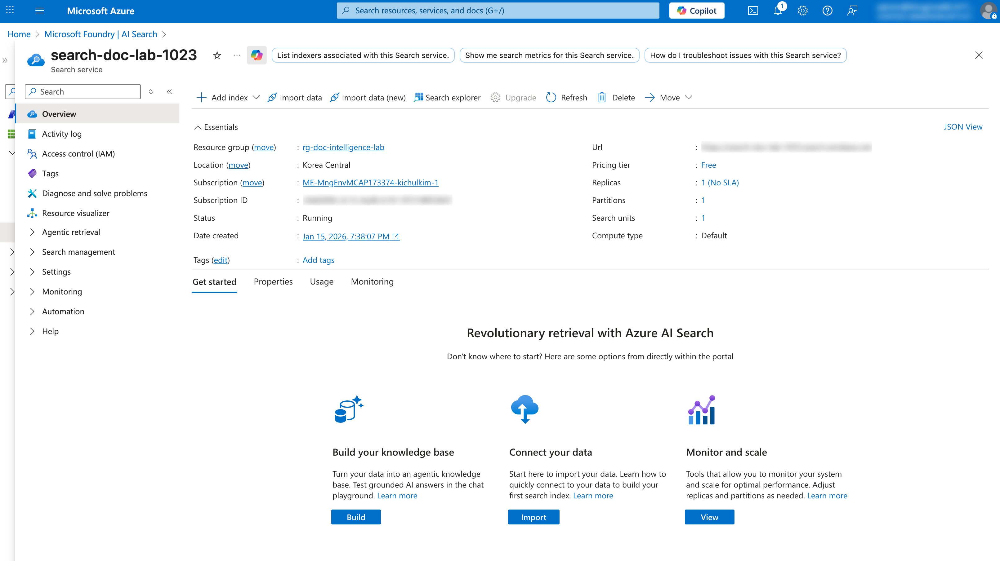

# 04. AI Search로 문서 인덱싱하기

이 문서에서는 Azure AI Search의 **Import data (new)** 기능과 **Multimodal RAG** 옵션을 사용하여 Document Intelligence와 연동하고, Blob Storage의 문서를 간편하게 인덱싱하는 방법을 안내합니다.

## 📋 목차

1. [개요](#1-개요)
2. [인덱싱 아키텍처 이해](#2-인덱싱-아키텍처-이해)
3. [Import data (new) 마법사 시작](#3-import-data-new-마법사-시작)
4. [Connect to your data](#4-connect-to-your-data)
5. [Content extraction](#5-content-extraction)
6. [Content embedding](#6-content-embedding)
7. [Image output](#7-image-output)
8. [Advanced settings](#8-advanced-settings)
9. [Review and create](#9-review-and-create)
10. [인덱싱 결과 확인](#10-인덱싱-결과-확인)

---

## 1. 개요

### Import data (new) 란?

Azure AI Search의 **Import data (new)** 는 인덱싱 설정을 간소화한 새로운 마법사입니다. **Multimodal RAG** 옵션을 통해 Document Intelligence, Azure OpenAI 임베딩 등을 한 번에 쉽게 연동할 수 있습니다.

### 주요 특징

| 항목 | 설명 |
|------|------|
| 간소화된 설정 | 통합된 UI로 한 번에 설정 |
| Document Intelligence 연동 | Multimodal RAG로 자동 연동 |
| 벡터 검색 | 임베딩 모델 자동 연동 |
| Knowledge Store | 통합 설정 가능 |

### 인덱싱 파이프라인 구성요소

| 구성요소 | 역할 |
|----------|------|
| **Data Source** | 문서가 저장된 위치 (Blob Storage) |
| **Skillset** | AI 기술 파이프라인 (Document Intelligence + 임베딩) |
| **Index** | 검색 가능한 데이터 스키마 |
| **Indexer** | 데이터 추출 및 인덱싱 실행 |

---

## 2. 인덱싱 아키텍처 이해

```
┌─────────────────────────────────────────────────────────────────┐
│              Import data (new) - Multimodal RAG 파이프라인        │
├─────────────────────────────────────────────────────────────────┤
│                                                                 │
│  ┌──────────────┐                      ┌──────────────┐        │
│  │ Blob Storage │─────────────────────▶│    Index     │        │
│  │  (문서 저장)  │                      │ (검색 스키마) │        │
│  └──────────────┘                      └──────────────┘        │
│         │                                     ▲                │
│         │                                     │                │
│         ▼                                     │                │
│  ┌──────────────────────────────────────────────┐             │
│  │            Multimodal RAG Skillset           │             │
│  │  ┌────────────────┐  ┌────────────────────┐  │             │
│  │  │   Document     │  │   Azure OpenAI     │  │             │
│  │  │  Intelligence  │  │   Embedding        │  │             │
│  │  │  (OCR/Layout)  │  │ (text-embedding)   │  │             │
│  │  └────────────────┘  └────────────────────┘  │             │
│  └──────────────────────────────────────────────┘             │
│                                                                │
└─────────────────────────────────────────────────────────────────┘
```

---

## 3. Import data (new) 마법사 시작

### 3.1 AI Search 리소스로 이동

1. **Azure Portal > AI Search 리소스로 이동**
2. **Overview 페이지 확인**

   

### 3.2 Import data (new) 시작

1. **상단 메뉴에서 `Import data (new)` 클릭**

   > ⚠️ **주의**: `Import data`가 아닌 **`Import data (new)`** 를 선택하세요.

   

2. **Multimodal RAG 선택**
   - 여러 옵션 중 **Multimodal RAG** 선택

   > 💡 **Multimodal RAG**: Document Intelligence를 사용하여 PDF에서 텍스트/테이블을 추출하고, Azure OpenAI로 벡터 임베딩 및 이미지 캡션을 생성합니다.

   

---

## 4. Connect to your data

데이터 소스를 설정합니다.

### 4.1 데이터 소스 설정

1. **다음 정보 입력**:

   | 필드 | 값 | 설명 |
   |------|-----|------|
   | Data source | `Azure Blob Storage` | 데이터 소스 유형 |
   | Subscription | 본인 구독 선택 | Azure 구독 |
   | Storage account | `stdocintellab[고유번호]` | 생성한 Storage Account |
   | Container | `documents` | Blob 컨테이너 |

2. **Managed Identity 인증**
   - `Authentication type`: **System-assigned managed identity** 선택

   

3. **Next** 클릭

---

## 5. Content extraction

Document Intelligence를 사용하여 문서에서 콘텐츠를 추출합니다.

### 5.1 Document Intelligence 연결

1. **다음 정보 선택**:

   | 필드 | 값 | 설명 |
   |------|-----|------|
   | Subscription | 본인 구독 | Azure 구독 |
   | Document Intelligence service | `doc-intel-lab-[고유번호]` | 생성한 리소스 |
   | Analysis mode | `Layout` | 텍스트 + 테이블 추출 |

   

### 5.2 추출 옵션

| 옵션 | 설명 |
|------|------|
| Layout | 텍스트, 테이블, 구조 정보 추출 |
| Read | 텍스트만 추출 (빠름) |

2. **Next** 클릭

---

## 6. Content embedding

Azure OpenAI를 사용하여 텍스트를 벡터 임베딩으로 변환합니다.

### 6.1 Azure OpenAI 임베딩 설정

1. **다음 정보 선택**:

   | 필드 | 값 | 설명 |
   |------|-----|------|
   | Subscription | 본인 구독 | Azure 구독 |
   | Azure OpenAI service | `ms-foundry-lab-[고유번호]` | Microsoft Foundry 리소스 |
   | Embedding model deployment | `text-embedding-3-large` | 임베딩 모델 |

   

### 6.2 임베딩 모델 정보

| 모델 | 차원 | 특징 |
|------|------|------|
| text-embedding-3-large | 3072 | 고품질 임베딩 |
| text-embedding-3-small | 1536 | 빠른 처리 |

2. **Next** 클릭

---

## 7. Image output

GPT-4o를 사용하여 문서 내 이미지에 대한 캡션을 생성합니다.

### 7.1 이미지 캡션 설정

1. **Enable image captioning** 활성화
2. **다음 정보 선택**:

   | 필드 | 값 | 설명 |
   |------|-----|------|
   | Subscription | 본인 구독 | Azure 구독 |
   | Azure OpenAI service | `ms-foundry-lab-[고유번호]` | Microsoft Foundry 리소스 |
   | Vision model deployment | `gpt-4o` | 이미지 캡션 생성 모델 |

   

### 7.2 이미지 캡션 기능

> 💡 **GPT-4o 이미지 캡션**: 문서에 포함된 이미지, 차트, 다이어그램 등을 GPT-4o가 분석하여 텍스트 설명을 생성합니다. 이를 통해 이미지 내용도 검색 가능해집니다.

| 기능 | 설명 |
|------|------|
| 이미지 분석 | 문서 내 이미지 자동 감지 |
| 캡션 생성 | GPT-4o로 이미지 설명 생성 |
| 검색 가능 | 생성된 캡션을 인덱싱하여 검색 |

3. **Next** 클릭

---

## 8. Advanced settings

인덱스 이름 및 스케줄 등 고급 설정을 구성합니다.

### 8.1 인덱스 설정

1. **다음 정보 입력**:

   | 필드 | 값 | 설명 |
   |------|-----|------|
   | Index name | `idx-documents` | 인덱스 이름 |
   | Enable semantic ranker | ✅ 체크 | 시맨틱 검색 활성화 |

   

### 8.2 스케줄 설정

1. **Indexer schedule** 선택:

   | 옵션 | 설명 |
   |------|------|
   | Once | 1회만 실행 (실습용 권장) |
   | Hourly | 매시간 실행 |
   | Daily | 매일 실행 |

2. **Schedule**: `Once` 선택

3. **Next** 클릭

---

## 9. Review and create

설정을 검토하고 인덱싱을 시작합니다.

### 9.1 설정 검토

1. **모든 설정 확인**:

   | 항목 | 확인 사항 |
   |------|----------|
   | Data source | Blob Storage 연결 확인 |
   | Content extraction | Document Intelligence 연결 확인 |
   | Content embedding | 임베딩 모델 확인 |
   | Image output | GPT-4o 캡션 설정 확인 |
   | Index name | 인덱스 이름 확인 |

   

### 9.2 인덱싱 생성

1. **`Create`** 버튼 클릭
2. **인덱싱이 자동으로 시작됨**

   

---

## 10. 인덱싱 결과 확인

### 10.1 생성된 리소스 확인

Import data (new)가 자동으로 생성하는 리소스:

| 리소스 | 이름 예시 | 설명 |
|--------|----------|------|
| Data Source | `ds-documents` | Blob Storage 연결 |
| Skillset | `ss-documents` | Document Intelligence + 임베딩 + 이미지 캡션 |
| Index | `idx-documents` | 검색 인덱스 |
| Indexer | `idxr-documents` | 인덱싱 실행기 |

### 10.2 인덱서 실행 상태 확인

1. **AI Search > Indexers 메뉴 클릭**
2. **생성된 인덱서 클릭하여 상태 확인**

   | 상태 | 설명 |
   |------|------|
   | In progress | 실행 중 |
   | Success | 완료 |
   | Failed | 실패 |

   

### 10.3 실행 히스토리 확인

1. **Execution history 탭 클릭**
2. **성공/실패한 문서 수 확인**

   | 항목 | 설명 |
   |------|------|
   | Documents succeeded | 성공 문서 수 |
   | Documents failed | 실패 문서 수 |
   | Items processed | 처리된 항목 수 |

   

### 10.4 인덱스 검색 테스트

1. **AI Search > Search explorer 메뉴 클릭**
2. **인덱스 선택**: `idx-documents`
3. **간단한 검색 쿼리 테스트**:

```json
{
  "search": "*",
  "count": true
}
```

4. **Search 클릭하여 결과 확인**

   

### 10.5 벡터 검색 테스트

Multimodal RAG로 생성된 벡터 필드를 활용한 검색:

```json
{
  "search": "문서에서 중요한 정보",
  "vectorQueries": [
    {
      "kind": "text",
      "text": "문서에서 중요한 정보",
      "fields": "vector",
      "k": 5
    }
  ],
  "select": "chunk, title",
  "count": true
}
```

   

### 10.6 이미지 캡션 확인

GPT-4o가 생성한 이미지 캡션이 인덱스에 저장되었는지 확인:

```json
{
  "search": "*",
  "select": "chunk, imageCaption, title",
  "filter": "imageCaption ne null",
  "count": true
}
```

   

---

## ✅ 체크리스트

AI Search 인덱싱이 완료되었는지 확인하세요:

- [ ] Import data (new) 마법사 시작 완료
- [ ] Multimodal RAG 옵션 선택 완료
- [ ] Connect to your data - Blob Storage 연결 완료
- [ ] Content extraction - Document Intelligence 연결 완료
- [ ] Content embedding - Azure OpenAI 임베딩 모델 연결 완료
- [ ] Image output - GPT-4o 이미지 캡션 설정 완료
- [ ] Advanced settings - 인덱스 이름 및 스케줄 설정 완료
- [ ] Review and create - 인덱싱 생성 완료
- [ ] 인덱서 실행 상태 Success 확인
- [ ] Search Explorer에서 검색 테스트 완료
- [ ] 벡터 검색 테스트 완료
- [ ] 이미지 캡션 결과 확인 완료

---

## 🔜 다음 단계

AI Search 인덱싱이 완료되면, 다음 튜토리얼에서 Knowledge Store를 생성하여 추출된 데이터를 저장하고 활용하는 방법을 학습합니다.

➡️ [05. Knowledge Store 생성하기](./05-knowledge-store.md)

---

## 🆘 문제 해결

### Q: Import data (new) 메뉴가 보이지 않습니다.
**A:** AI Search 리소스의 SKU를 확인하세요. Basic 이상 SKU에서 사용 가능합니다. 또한 최신 Azure Portal 버전인지 확인하세요.

### Q: Multimodal RAG 옵션이 비활성화되어 있습니다.
**A:** Document Intelligence와 Azure OpenAI 리소스가 동일 구독에 있어야 합니다. 또한 각 리소스에 대한 접근 권한이 있는지 확인하세요.

### Q: 인덱서 실행이 실패합니다.
**A:** 다음을 확인하세요:
- AI Search의 Managed Identity가 활성화되어 있는지
- Storage Account에 `Storage Blob Data Reader` 역할이 할당되어 있는지
- Document Intelligence에 `Cognitive Services User` 역할이 할당되어 있는지
- Microsoft Foundry에 `Cognitive Services OpenAI User` 역할이 할당되어 있는지

### Q: 문서 수가 0으로 표시됩니다.
**A:** Blob Container에 문서가 업로드되어 있는지 확인하세요. 데이터 소스의 Container name이 올바른지도 확인하세요.

### Q: 벡터 검색이 작동하지 않습니다.
**A:** Azure OpenAI 임베딩 모델이 올바르게 연결되었는지 확인하세요. 인덱스에 벡터 필드가 생성되었는지 확인하세요.

### Q: 이미지 캡션이 생성되지 않습니다.
**A:** GPT-4o 모델이 Microsoft Foundry에 배포되어 있는지 확인하세요. Image output 단계에서 Vision model deployment가 올바르게 선택되었는지 확인하세요.

### Q: 인덱싱에 시간이 오래 걸립니다.
**A:** 문서 수와 크기에 따라 시간이 달라집니다. Document Intelligence, 임베딩, 이미지 캡션 처리가 포함되어 시간이 더 소요될 수 있습니다.
