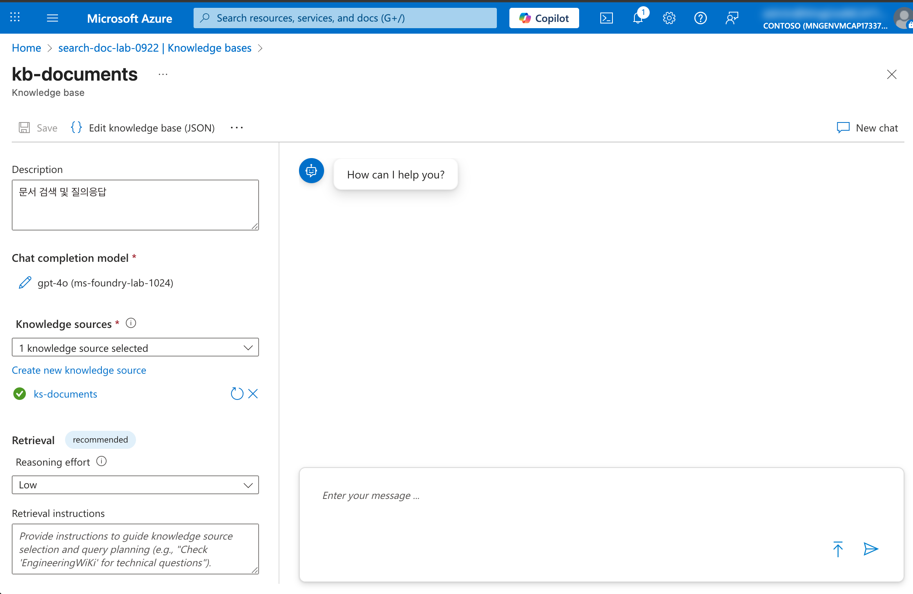

# 05. Knowledge Base 생성하기

이 문서에서는 Azure AI Search의 **Knowledge sources**와 **Knowledge bases**를 생성하여 인덱싱된 데이터를 기반으로 대화형 검색 및 RAG(Retrieval-Augmented Generation) 기능을 활용하는 방법을 안내합니다.

## 📋 목차

1. [개요](#1-개요)
2. [Knowledge sources 생성](#2-knowledge-sources-생성)
3. [Knowledge bases 생성](#3-knowledge-bases-생성)
4. [Knowledge Base 검색 테스트](#4-knowledge-base-검색-테스트)

---

## 1. 개요

### Knowledge Base란?

Azure AI Search의 Knowledge Base는 인덱싱된 문서 데이터를 기반으로 대화형 검색 및 질의응답을 제공하는 기능입니다. Knowledge sources로 데이터 소스를 정의하고, Knowledge bases로 검색 및 RAG 기능을 구성합니다.

### Knowledge sources vs Knowledge bases

| 항목 | Knowledge sources | Knowledge bases |
|------|------------------|-----------------|
| 역할 | 데이터 소스 정의 | 검색 및 RAG 구성 |
| 구성 요소 | 인덱스 연결 | Knowledge sources + AI 모델 |
| 용도 | 검색 대상 지정 | 대화형 질의응답 |

---

## 2. Knowledge sources 생성

인덱싱된 데이터를 Knowledge source로 등록합니다.

### 2.1 Knowledge sources 메뉴 이동

1. **AI Search > Knowledge sources 메뉴 클릭**
2. **`+ Add knowledge source` 클릭**

   

### 2.2 Knowledge source 설정

1. **다음 정보 입력**:

   | 필드 | 값 | 설명 |
   |------|-----|------|
   | Name | `ks-documents` | Knowledge source 이름 |
   | Index | 앞서 생성한 인덱스 선택 | 인덱싱된 문서 인덱스 |
   | Content field | `chunk` | 검색할 콘텐츠 필드 |
   | Vector field | `vector` | 벡터 검색 필드 |
   | Title field | `title` | 문서 제목 필드 |

   

2. **Create 클릭**

### 2.3 생성 확인

1. **Knowledge sources 목록에서 생성된 항목 확인**

   

---

## 3. Knowledge bases 생성

Knowledge source를 기반으로 Knowledge base를 생성합니다.

### 3.1 Knowledge bases 메뉴 이동

1. **AI Search > Knowledge bases 메뉴 클릭**
2. **`+ Create knowledge base` 클릭**

   

### 3.2 Knowledge base 설정

1. **기본 정보 입력**:

   | 필드 | 값 | 설명 |
   |------|-----|------|
   | Name | `kb-documents` | Knowledge base 이름 |
   | Description | `문서 검색 및 질의응답` | 설명 |

2. **Knowledge sources 선택**:
   - 앞서 생성한 `ks-documents` 선택

   

### 3.3 AI 모델 연결 (선택사항)

RAG 기능을 사용하려면 Azure OpenAI 모델을 연결합니다.

1. **다음 정보 선택**:

   | 필드 | 값 | 설명 |
   |------|-----|------|
   | Subscription | 본인 구독 | Azure 구독 |
   | Azure OpenAI service | `ms-foundry-lab-[고유번호]` | Microsoft Foundry 리소스 |
   | Chat model deployment | `gpt-4o` | 대화 생성 모델 |

   

2. **Create 클릭**

### 3.4 생성 확인

1. **Knowledge bases 목록에서 생성된 항목 확인**

   

---

## 4. Knowledge Base 검색 테스트

생성된 Knowledge base를 사용하여 검색을 테스트합니다.

### 4.1 Knowledge base 테스트 화면 이동

1. **생성된 Knowledge base 클릭**
2. **`Test` 탭 클릭**

   

### 4.2 검색 쿼리 테스트

1. **질문 입력**:
   ```
   건강 보험의 주요 혜택은 무엇인가요?
   ```

2. **Send 클릭**

3. **결과 확인**:
   - 관련 문서 청크가 검색됨
   - AI 모델이 연결된 경우 답변도 생성됨

   

### 4.3 다양한 질문 테스트

| 질문 예시 | 기대 결과 |
|----------|----------|
| `sustainability 전략은?` | 지속가능성 관련 문서 검색 |
| `직원 복지 프로그램` | 복지 관련 내용 검색 |
| `AI 활용 사례` | AI 관련 내용 검색 |

### 4.4 벡터 검색 확인

1. **의미 기반 검색 테스트**:
   - 정확한 키워드가 아닌 의미적으로 유사한 질문으로 검색
   - 예: "환경 보호" → "sustainability" 관련 문서 검색됨

   

---

## ✅ 체크리스트

Knowledge Base 생성이 완료되었는지 확인하세요:

- [ ] Knowledge sources 생성 완료
- [ ] Knowledge sources에 인덱스 연결 완료
- [ ] Knowledge bases 생성 완료
- [ ] Knowledge bases에 Knowledge sources 연결 완료
- [ ] AI 모델 연결 완료 (선택사항)
- [ ] 검색 테스트 완료
- [ ] 벡터 검색 테스트 완료

---

## 🔜 다음 단계

Knowledge Base 생성이 완료되면, 다음 튜토리얼에서 다양한 검색 기능을 활용하는 방법을 학습합니다.

➡️ [06. 검색 기능 활용하기](./06-search.md)

---

## 🆘 문제 해결

### Q: Knowledge sources 메뉴가 보이지 않습니다.
**A:** AI Search 리소스의 SKU를 확인하세요. 최신 기능은 Basic 이상 SKU에서 사용 가능합니다.

### Q: 인덱스가 Knowledge source 목록에 나타나지 않습니다.
**A:** 인덱서가 성공적으로 실행되었는지 확인하세요. 인덱스에 데이터가 있어야 합니다.

### Q: 검색 결과가 없습니다.
**A:** 다음을 확인하세요:
- Knowledge source의 Content field가 올바르게 설정되었는지
- 인덱스에 데이터가 인덱싱되었는지
- 검색어가 문서 내용과 관련이 있는지

### Q: AI 답변이 생성되지 않습니다.
**A:** Azure OpenAI 모델이 올바르게 연결되었는지 확인하세요. Microsoft Foundry에 GPT-4o 모델이 배포되어 있어야 합니다.

### Q: 벡터 검색이 작동하지 않습니다.
**A:** Knowledge source 설정에서 Vector field가 올바르게 지정되었는지 확인하세요. 인덱스에 벡터 필드가 존재해야 합니다.
