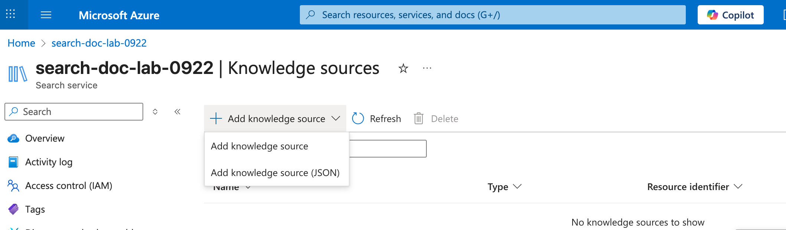
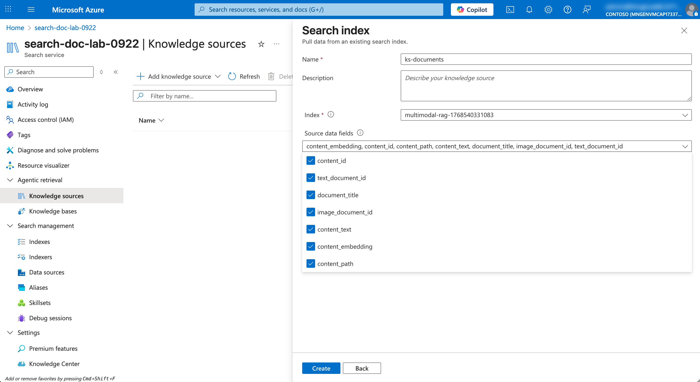
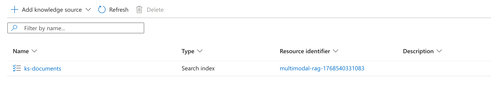
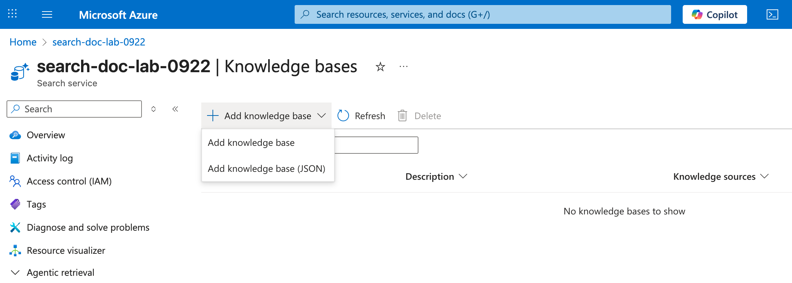
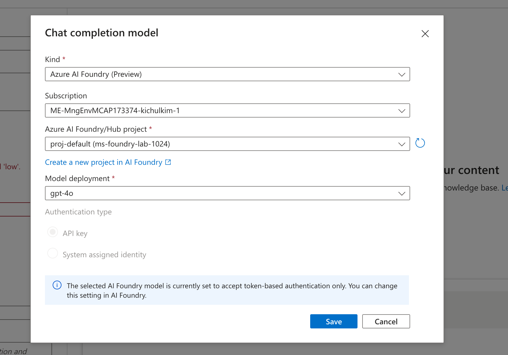
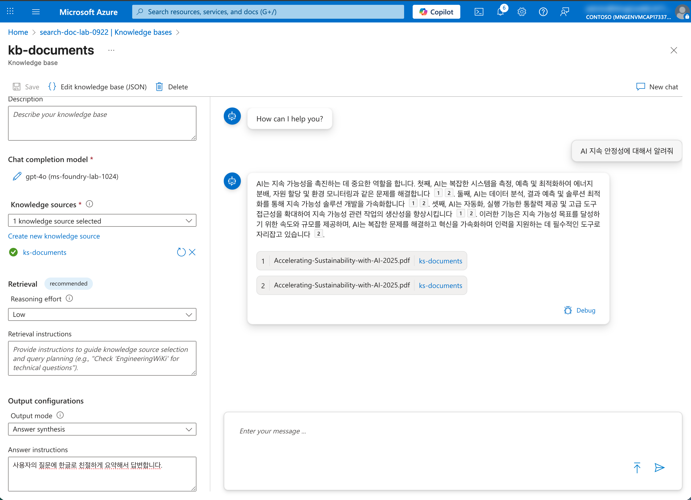

# 05. Knowledge Base 생성하기

이 문서에서는 Azure AI Search의 **Knowledge sources**와 **Knowledge bases**를 생성하여 인덱싱된 데이터를 기반으로 에이전틱 검색(Agentic Retrieval) 및 RAG(Retrieval-Augmented Generation) 기능을 활용하는 방법을 안내합니다.

## 📋 목차

1. [개요](#1-개요)
2. [Knowledge sources 생성](#2-knowledge-sources-생성)
3. [Knowledge bases 생성](#3-knowledge-bases-생성)
4. [Knowledge Base 검색 테스트](#4-knowledge-base-검색-테스트)

---

## 1. 개요

### Knowledge Base란?

Azure AI Search의 Knowledge Base는 인덱싱된 문서 데이터를 기반으로 에이전틱 검색(Agentic Retrieval) 기반으로 질의응답을 제공하는 기능입니다.

---

## 2. Knowledge sources 생성

인덱싱된 데이터를 Knowledge source로 등록합니다.

### 2.1 Knowledge sources 메뉴 이동

1. **AI Search > Agentic retrieval > Knowledge sources 메뉴 클릭**
2. **`+ Add knowledge source` 클릭**

   

### 2.2 Knowledge source 설정
1. **Search index 선택**
2. **다음 정보 입력**:

   | 필드 | 값 | 설명 |
   |------|-----|------|
   | Name | `ks-documents` | Knowledge source 이름 |
   | Index | `multimodal-rag-1234` | 앞서 생성한 인덱스 |
   | Source field | `전체 선택` | 검색할 콘텐츠 필드 |

   

3. **Create 클릭**

### 2.3 생성 확인

1. **Knowledge sources 목록에서 생성된 항목 확인**

   

---

## 3. Knowledge bases 생성

Knowledge source를 기반으로 Knowledge base를 생성합니다.

### 3.1 Knowledge bases 메뉴 이동

1. **AI Search > Agentic retrieval > Knowledge bases 메뉴 클릭**
2. **`+ Add knowledge base` 클릭**

   

### 3.2 Knowledge base 설정

1. **기본 정보 입력**:

   | 필드 | 값 | 설명 |
   |------|-----|------|
   | Name | `kb-documents` | Knowledge base 이름 |
   | Description | `문서 검색 및 질의응답` | 설명 |

2. **Knowledge sources 선택**:
   - 앞서 생성한 `ks-documents` 선택

### 3.3 AI 모델 연결 (선택사항)

Low level 이상의 Agentic Retrieval 기능을 사용하려면 Azure OpenAI 모델을 연결합니다.

1. **응답 모델 사용 설정**
   - `+Add model deployment` 클릭

2. **다음 정보 선택**:

   | 필드 | 값 | 설명 |
   |------|-----|------|
   | Subscription | 본인 구독 | Azure 구독 |
   | Azure OpenAI service | `ms-foundry-lab-[고유번호]` | Microsoft Foundry 리소스 |
   | Chat model deployment | `gpt-4o` | 대화 생성 모델 |

   

3. **응답 모드 설정**
   - Output mode 를 `Answer synthesis` 로 선택
   - Answer instructions 에 원하는 답변 스타일 입력 (예: `사용자의 질문에 한글로 친절하게 요약해서 답변합니다.`)
  
4. **Save 클릭**


---

## 4. Knowledge Base 검색 테스트

생성된 Knowledge base를 사용하여 검색을 테스트합니다.

### 4.1 Knowledge base 테스트 화면 이동

1. **생성된 Knowledge base 클릭**
2. **질문 입력 후 전송**:
   ```
   AI 지속 안정성에 대해서 알려줘
   ```
3. **결과 확인**:
   - 관련 문서 청크가 검색됨
   - AI 모델이 연결된 경우 답변도 생성됨
   


---

## ✅ 체크리스트

Knowledge Base 생성이 완료되었는지 확인하세요:

- [ ] Knowledge sources 생성 완료
- [ ] Knowledge sources에 인덱스 연결 완료
- [ ] Knowledge bases 생성 완료
- [ ] Knowledge bases에 Knowledge sources 연결 완료
- [ ] AI 모델 연결 완료 (선택사항)
- [ ] 검색 테스트 완료

---

## 🔜 다음 단계

Knowledge Base 생성이 완료되면, 다음 튜토리얼에서 다양한 검색 기능을 활용하는 방법을 학습합니다.

➡️ [06. 검색 기능 활용하기](./06-search.md)

---

## 🆘 문제 해결

### Q: 검색 결과가 없습니다.
**A:** 다음을 확인하세요:
- Knowledge source의 Content field가 올바르게 설정되었는지
- 인덱스에 데이터가 인덱싱되었는지
- 검색어가 문서 내용과 관련이 있는지

### Q: AI 답변이 생성되지 않습니다.
**A:** Azure OpenAI 모델이 올바르게 연결되었는지 확인하세요. Microsoft Foundry에 GPT-4o 모델이 배포되어 있어야 합니다.

